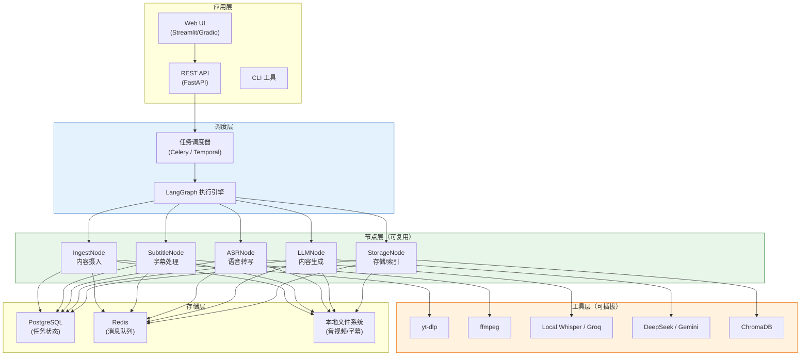
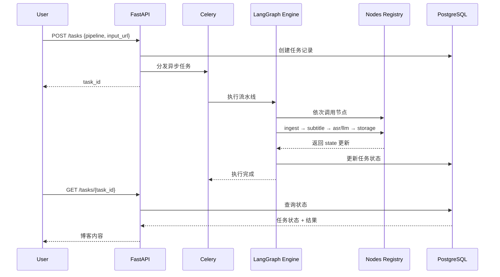
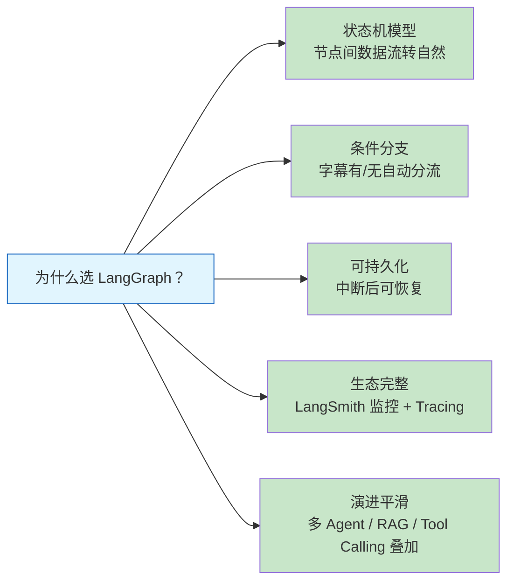
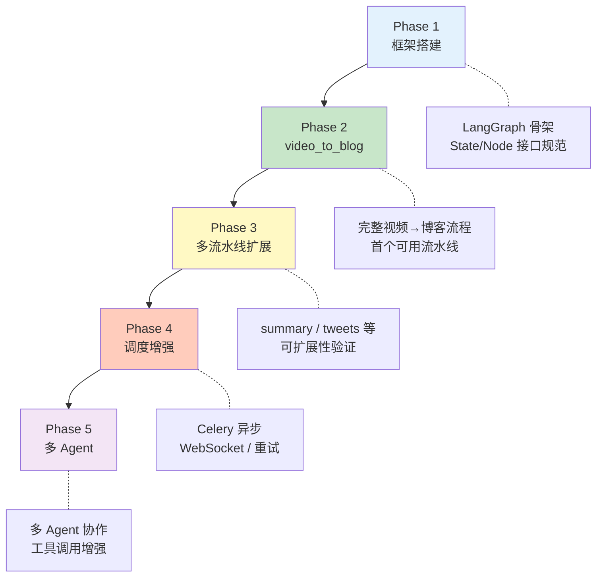
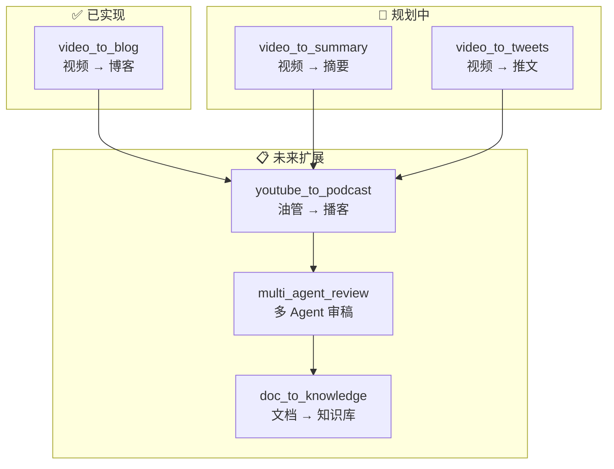
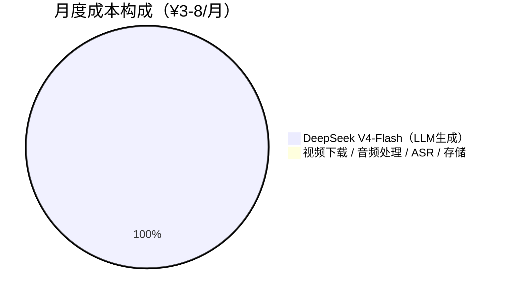

# AI Pipeline Platform - 智能任务编排平台

> 本文档基于 2026-06-06 讨论，记录平台架构设计与首个流水线实现。
>
> **核心理念**：视频转博客只是第一个场景，底层是一套通用的 LangGraph 任务编排平台，支持未来扩展更多任务流。

---

## 一、目标概述

构建一套基于 LangGraph 的通用 AI 任务编排平台：

- **短期目标**：将 Bilibili 视频自动转化为结构化博客文章
- **长期目标**：平台化，支持多任务流接入、工具可插拔、多 Agent 协作

---

## 二、平台架构

### 2.1 系统分层



### 2.2 核心执行流程



---

## 三、框架选型

### 3.1 编排框架对比

| 框架 | 定位 | 多任务流 | 推荐度 |
|------|------|----------|--------|
| **LangGraph** | LLM 任务编排 / 状态机 | ⭐⭐⭐⭐ 强 | ✅ 首选 |
| CrewAI | 多 Agent 协作 | ⭐⭐⭐ 一般 | 简单场景 |
| AutoGen | 多 Agent 对话 | ⭐⭐⭐ 一般 | 开发者友好 |
| Dify | 无代码平台 | ⭐⭐⭐ 弱 | 快速验证 |
| FastAPI 自研 | 底层框架 | 完全可控 | 极致定制 |

### 3.2 选择 LangGraph 的理由



---

## 四、核心代码设计

### 4.1 当前状态定义（与实现保持一致）

```python
class PipelineState(TypedDict, total=False):
    task_id: str
    video_url: str
    pipeline_type: str
    created_at: str
    updated_at: str

    video_id: str | None
    task_dir: str | None
    video_title: str
    video_path: str | None
    subtitle_path: str | None
    audio_path: str | None
    transcript: str | None
    source_text: str | None
    blog_content: str | None
    article_title: str | None
    output_path: str | None

    has_subtitle: bool
    status: PipelineStatus
    error: str | None
    node_results: dict[str, Any]
```

### 4.2 当前节点职责（贴近现有实现）

```python
# nodes/ingest.py
# 仅抓取视频元信息，不下载完整视频
# 写入 video_id / video_title / node_results.ingest

# nodes/subtitle.py
# 优先下载现有字幕或自动字幕
# 若成功则写入 subtitle_path、has_subtitle=True
# 并立即持久化任务状态，避免后续失败时丢失中间结果

# nodes/asr.py
# 仅在无字幕时执行
# 使用 yt-dlp 下载 bestaudio，并通过 FFmpegExtractAudio 转成 wav
# 再调用 Groq Whisper 转写，写入 audio_path / transcript / source_text

# nodes/llm.py
# 优先使用 transcript；若不存在则读取 subtitle_path 对应文本
# 调用 DeepSeek 生成结构化中文博客，写入 blog_content

# nodes/storage.py
# 将博客 Markdown 落盘到 data/blogs/<YYYY-MM-DD>_<文章标题>.md
# 文件名格式：<日期>_<文章标题>.md，标题从 LLM 生成内容中提取
# 写入 output_path，并标记任务成功
```

### 4.4 当前产物落盘约定

- 任务状态：`data/tasks/<task_id>.json`
- 博客结果：`data/blogs/<YYYY-MM-DD>_<文章标题>.md`
- 音频/字幕等中间资源：`data/video_down/<task_dir>/`
- `task_dir` 命名格式：`<YYYYMMDD_HHMMSS>_<task_id>`
- 若字幕节点已成功，相关 `subtitle_path` / `has_subtitle` 会立即持久化，即使后续节点失败也会保留

### 4.5 图构建（条件边实现分支）

```python
from langgraph.graph import StateGraph, END

def should_skip_asr(state: PipelineState) -> str:
    """字幕存在则跳过 ASR，节省 15-20 分钟"""
    return "asr_node" if not state.get("skip_asr") else "llm_node"

def build_video_to_blog_graph():
    graph = StateGraph(PipelineState)
    graph.add_node("ingest", ingest_node)
    graph.add_node("subtitle", subtitle_node)
    graph.add_node("asr", asr_node)
    graph.add_node("llm", llm_node)
    graph.add_node("storage", storage_node)

    graph.add_edge("ingest", "subtitle")
    graph.add_conditional_edges("subtitle", should_skip_asr)
    graph.add_edge("llm", "storage")
    graph.add_edge("storage", END)

    return graph.compile()
```

### 4.4 流水线注册机制（核心扩展点）

```python
# engine/registry.py
class PipelineRegistry:
    _pipelines: dict[str, Any] = {}

    @classmethod
    def register(cls, name: str):
        def decorator(func):
            cls._pipelines[name] = func()
            return func
        return decorator

    @classmethod
    def get(cls, name: str) -> Any:
        return cls._pipelines[name]

# pipelines/video_to_blog.py
@PipelineRegistry.register("video_to_blog")
def video_to_blog_pipeline() -> StateGraph:
    """视频转博客流水线"""
    ...

# pipelines/video_to_summary.py
@PipelineRegistry.register("video_to_summary")
def video_to_summary_pipeline() -> StateGraph:
    """视频转摘要流水线"""
    ...

# pipelines/youtube_to_podcast.py  # 未来
@PipelineRegistry.register("youtube_to_podcast")
def yt_to_podcast_pipeline() -> StateGraph:
    ...
```

### 4.5 服务工厂（工具可替换）

```python
# tools/asr_factory.py
class ASRServiceFactory:
    @staticmethod
    def get(service: str):
        services = {
            "local_whisper": LocalWhisperASR(),  # 默认，选首后不需要外网
            "groq": GroqASRService(),  # 备用，需配置 ASR_PROVIDER=groq
        }
        return services[service]

# tools/llm_factory.py
class LLMServiceFactory:
    @staticmethod
    def get(provider: str):
        providers = {
            "deepseek": DeepSeekLLM(),
            "gemini": GeminiLLM(),
            "openai": OpenAILLM(),
        }
        return providers[provider]
```

---

## 五、API 层设计

```python
# api/routes/tasks.py
from fastapi import FastAPI
from pydantic import BaseModel
from datetime import datetime

app = FastAPI(title="AI Pipeline Platform")

class TaskRequest(BaseModel):
    pipeline: str              # "video_to_blog" | "video_to_summary" | ...
    input_url: str
    config: dict = {}          # 可选参数覆盖

class TaskResponse(BaseModel):
    task_id: str
    status: str
    created_at: datetime

@app.post("/tasks")
def create_task(req: TaskRequest) -> TaskResponse:
    task_id = schedule_task(req.pipeline, req.input_url, req.config)
    return TaskResponse(task_id=task_id, status="pending", created_at=datetime.now())

@app.get("/tasks/{task_id}")
def get_task(task_id: str) -> dict:
    return get_task_status(task_id)

@app.get("/pipelines")
def list_pipelines() -> list[str]:
    return list(PipelineRegistry._pipelines.keys())
```

---

## 六、目录结构

```
ai_platform/
├── api/                    # FastAPI 网关
│   └── routes/
│       ├── tasks.py        # 任务 CRUD
│       └── webhooks.py     # 回调通知
├── engine/                 # LangGraph 执行引擎
│   ├── graph.py           # 图构建
│   ├── state.py           # 状态定义
│   └── registry.py        # 流水线注册
├── nodes/                  # 节点实现
│   ├── ingest.py          # 内容摄入
│   ├── subtitle.py        # 字幕处理
│   ├── asr.py             # 语音转写
│   ├── llm.py             # 内容生成
│   └── storage.py         # 存储/索引
├── tools/                  # 底层工具封装（可插拔）
│   ├── yt_dlp_tool.py
│   ├── ffmpeg_tool.py
│   ├── whisper_tool.py
│   ├── deepseek_tool.py
│   └── chromadb_tool.py
├── pipelines/              # 流水线定义
│   ├── video_to_blog.py   # ✅ 首个流水线
│   ├── video_to_summary.py
│   └── __future__/       # 未来流水线占位
├── scheduler/              # 任务调度
│   └── celery_app.py
├── models/                # 数据模型
│   └── schemas.py
└── config/
    └── settings.py         # 服务配置（ASR/LLM 可切换）
```

---

## 七、实施路线



| 阶段 | 内容 | 预计代码量 |
|------|------|-----------|
| Phase 1 | LangGraph + FastAPI 骨架，State / Node 接口规范 | ~300 行 |
| Phase 2 | 完整 video_to_blog 流水线，通过注册接入 | ~500 行 |
| Phase 3 | 注册 2-3 个新流水线（summary / tweets 等）| ~200 行 |
| Phase 4 | Celery 异步、WebSocket 推送、任务重试 | ~400 行 |
| Phase 5 | 多 Agent 协作流水线 | ~300 行 |
| **合计** | | **~1700 行** |

---

## 八、工具链详细说明

### 8.1 视频处理

- **yt-dlp**：从 B站下载视频/音频/字幕（注意：它不能替代 ffmpeg）
- **ffmpeg**：音视频格式转换，输出 Whisper 所需的 16kHz 单声道 WAV

### 8.2 ASR 方案对比

| 方案 | 费用 | 速度 | 推荐度 |
|------|------|------|--------|
| **本地 Whisper small（CPU）**| ¥0 | 12-20分钟/30分钟 | ⭐⭐⭐ 首选（已默认启用）|
| Groq Whisper API | 免费 | < 30秒/30分钟 | ⭐⭐ 备用（网络不稳定时降级）|
| SiliconFlow FunAudioLLM | ¥0.1/分钟 | 快 | ⭐ 备用 |

> ⚠️ **Groq Whisper API 存在网络调用不稳定性，已切换为本地 Whisper 作为默认 ASR 方案。**
> 如需恢复 Groq，在 `.env` 中设置 `ASR_PROVIDER=groq` 即可。
> Groq 注册地址：https://console.groq.com

**i5-12500H CPU 转写性能预估：**
- tiny：2-4 分钟（精度差，不推荐）
- base：5-8 分钟（一般）
- **small：12-20 分钟（推荐，精度良好）**
- medium：30-50 分钟（偏慢）
- large-v3：60-100 分钟（CPU太慢，不考虑）

### 8.3 LLM 方案

| 模型 | 价格（/百万 tokens）| 适用场景 |
|------|---------------------|----------|
| **DeepSeek V4-Pro** | ¥0.87 输入 / ¥1.74 输出 | 复杂博客生成 |
| **DeepSeek V4-Flash** | ¥0.14 输入 / ¥0.28 输出 | 日常快速处理 |
| Gemini Flash 2.0 | 免费（有配额）| 备用、多模态扩展 |

> DeepSeek V4 官方定价：https://api-docs.deepseek.com
>
> ⚠️ **DeepSeek V4 是纯文本 LLM，不具备语音转文字（ASR）功能**

---

## 九、注册流水线一览



---

## 十、成本估算（每月）

假设每天处理 3 个 30 分钟视频：



| 环节 | 方案 | 月成本 |
|------|------|--------|
| 视频下载 | yt-dlp + B站 cookies | ¥0 |
| 音频处理 | ffmpeg | ¥0 |
| 语音转写 | Groq（免费）+ 本地降级 | ¥0 |
| LLM 生成 | DeepSeek V4-Flash | ¥3-8 |
| 向量存储 | ChromaDB 本地 | ¥0 |
| 存储 | 本地 SSD | ¥0 |
| **总计** | | **¥3-8/月** |

---

## 十一、环境验证清单

```bash
# 1. 确认 yt-dlp 能解析 B 站视频
yt-dlp --list-subs "https://www.bilibili.com/video/BV1xx411c7mD"

# 2. 确认 Whisper 可用
python -c "import whisper; print('Whisper OK')"

# 3. 确认 ffmpeg / ffprobe 可用
ffmpeg -version
ffprobe -version

# 4. 若未加入 PATH，可在 .env 中配置
# FFMPEG_LOCATION=/path/to/ffmpeg/bin

# 5. 确认 DeepSeek API 可用
curl https://api.deepseek.com/chat/completions \
  -H "Content-Type: application/json" \
  -H "Authorization: Bearer ${DEEPSEEK_API_KEY}" \
  -d '{
    "model": "deepseek-v4-flash",
    "messages": [{"role": "user", "content": "你好"}]
  }'

# 5. Groq Whisper API 测试（如已注册）
from groq import Groq
client = Groq(api_key="your-key")

# 6. 确认 LangGraph 可用（平台核心依赖）
python -c "from langgraph.graph import StateGraph; print('LangGraph OK')"
```

---

## 十二、技术限制说明

- **DeepSeek V4 无 ASR 能力**：是纯文本 LLM，语音转文字必须依赖独立 ASR 服务（如 Whisper/Groq）
- **B站字幕获取**：约 20-30% 视频有字幕，知识区成功率更高，建议优先尝试再降级
- **分P视频**：需解析后按集逐一处理
- **B站下载认证**：高画质下载需要 SESSDATA（从手机 App 登录获取）
