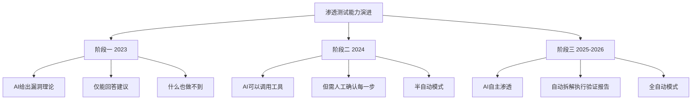
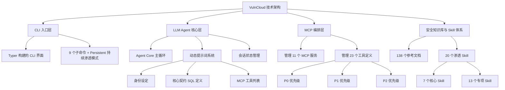

# AI 安全进化史：从“脚本小子”到自主渗透的 Agent 战争

## 摘要
本文基于 B 站视频内容，系统梳理了 AI 在网络安全领域从 2022 年底到 2026 年的进化历程。文章涵盖了 AI 早期在渗透测试中的四大困境（知识截止、无法执行命令、无状态、缺乏攻击思维），到 Function Calling、MCP 协议、Skills 体系等技术突破如何逐步赋予 AI 自主渗透能力。最后，文章介绍了开源项目 **VulnCloud**，展示了一个专为国内安全场景设计的 AI 驱动渗透测试框架，并探讨了 AI 对安全行业门槛、效率与攻防格局的深远影响。

## 目录
- [AI 安全进化史：从“脚本小子”到自主渗透的 Agent 战争](#ai-安全进化史从脚本小子到自主渗透的-agent-战争)
  - [摘要](#摘要)
  - [目录](#目录)
  - [技术关键词](#技术关键词)
  - [核心观点](#核心观点)
  - [1. 早期 AI 渗透的四大困境（2022-2023）](#1-早期-ai-渗透的四大困境2022-2023)
    - [1.1 知识截止](#11-知识截止)
    - [1.2 无法执行命令](#12-无法执行命令)
    - [1.3 无状态](#13-无状态)
    - [1.4 缺乏攻击思维](#14-缺乏攻击思维)
  - [2. 转折点：Function Calling 与 MCP 协议](#2-转折点function-calling-与-mcp-协议)
    - [2.1 Function Calling：给 AI 配上电脑](#21-function-calling给-ai-配上电脑)
    - [2.2 MCP 协议：统一工具调用的标准](#22-mcp-协议统一工具调用的标准)
  - [3. Skills 体系：让 AI 像专家一样工作](#3-skills-体系让-ai-像专家一样工作)
    - [3.1 什么是 Skills](#31-什么是-skills)
    - [3.2 Skills 的安全隐患](#32-skills-的安全隐患)
  - [4. AI Agent 的自主渗透时代（2025-2026）](#4-ai-agent-的自主渗透时代2025-2026)
    - [4.1 Agent 的三大特征](#41-agent-的三大特征)
    - [4.2 渗透测试三阶段对比](#42-渗透测试三阶段对比)
  - [5. 行业影响：门槛降低与效率提升](#5-行业影响门槛降低与效率提升)
    - [5.1 CTF 比赛中的 AI Agent](#51-ctf-比赛中的-ai-agent)
    - [5.2 漏洞发现与利用加速](#52-漏洞发现与利用加速)
    - [5.3 渗透测试报告自动化](#53-渗透测试报告自动化)
  - [6. 开源实践：VulnCloud 项目](#6-开源实践vulncloud-项目)
    - [6.1 项目定位](#61-项目定位)
    - [6.2 技术架构](#62-技术架构)
    - [6.3 核心功能](#63-核心功能)
    - [6.4 特色设计](#64-特色设计)
  - [7. 总结与展望](#7-总结与展望)
  - [思维导图](#思维导图)

## 技术关键词
AI Agent、渗透测试、MCP 协议、Skills 体系、Function Calling、CTF、漏洞发现、安全自动化、VulnCloud、越狱插件

## 核心观点
1. **AI 安全能力飞跃**：从 2022 年底连简单 SQL 注入都完成不了，到 2026 年能自主打穿靶场、拿下 root 权限，AI 在安全领域的进化速度惊人。
2. **技术突破是关键**：Function Calling、MCP 协议、Skills 体系三大技术突破，让 AI 从“理论家”变成了“实战者”。
3. **安全生态双刃剑**：MCP 和 Skills 在带来便利的同时，也引入了供应链安全风险（如恶意 Skill、MCP 服务器劫持）。
4. **行业门槛降低**：AI 使低技能攻击者能快速放大攻击能力，渗透测试从“经验积累”转向“工具+AI 驱动”。
5. **效率碾压**：AI 在重复劳动（如报告生成）上碾压人类，漏洞从披露到被利用的时间中位数从 32 天压缩到 5 天。
6. **拥抱而非抗拒**：AI 不会取代安全研究员，但会用 AI 的安全研究员会取代不会用的。

## 1. 早期 AI 渗透的四大困境（2022-2023）

在 ChatGPT 刚发布的 2022 年底，安全圈尝试用 AI 挖漏洞，结果发现它像个“纸上谈兵”的专家——理论强、实战崩。主要存在以下四个问题：

### 1.1 知识截止
AI 只知道训练数据截止前的知识。比如分析 CVE 漏洞时，它可能编造一个不存在的 CVE 编号，或者影响版本完全错误。**幻觉问题严重**，一半以上的建议可能是虚构的。

### 1.2 无法执行命令
AI 能告诉你“建议用 Nmap 扫描端口”或“用 SQLmap 测试注入”，但它自己无法执行这些命令。它像一个脑子里有无限编程知识、但没有电脑的人。

### 1.3 无状态
每次对话都是全新的开始，没有记忆，没有上下文。无法做持续性的渗透测试——关掉对话后，一切归零。

### 1.4 缺乏攻击思维
安全圈有句话叫“Think like an attacker”，但早期 GPT 更像蓝队（防守方）。它能告诉你代码是否符合安全规范，但不会主动去想“如果我故意绕过这个检查会怎样”。它是个**理论扎实、实战拉胯**的“书呆子黑客”。

## 2. 转折点：Function Calling 与 MCP 协议

### 2.1 Function Calling：给 AI 配上电脑
2023 年中，OpenAI 推出 **Function Calling** 功能。这相当于给那个“脑子里有知识但没电脑”的人配了一台电脑，AI 终于可以开始操作了：
- **查 CVE**：以前只能回答“我的知识截止到 X 年”，现在可以调用 API 查最新漏洞库。
- **端口扫描**：以前只能回答“我无法直接扫描”，现在可以调用 Nmap 工具。
- **SQL 注入测试**：以前只能给理论建议，现在可以直接调用 SQLmap 返回测试结果。

但新问题出现了：每个平台的工具调用格式不同——OpenAI 有 OpenAI 的格式，Claude 有 Claude 的格式，国产模型又是另一套。**没有统一标准**，工具开发一次只能适配一个模型。

### 2.2 MCP 协议：统一工具调用的标准
2024 年 11 月，Anthropic 发布了 **MCP 协议**（Model Context Protocol）。这就像给所有 AI 模型和工具之间定义了一个“USB-C 接口”——工具只需要开发一次，就能被所有支持 MCP 的 AI 模型调用。

MCP 在安全圈的传播极快，安全工具开始大规模 MCP 化：
- **fetch**：发 HTTP 请求，测试边界
- **Chrome DevTools**：浏览器自动化，XSS 测试
- **Burp Suite**：抓包重放
- **Frida MCP**：移动端 Hook
- **ADB MCP**：控制安卓设备
- **JD-GUI MCP**：反编译
- **IDAPRO MCP**：二进制逆向

整个安全工具链开始以 MCP 为纽带连接起来，生态以前所未有的速度繁荣。

## 3. Skills 体系：让 AI 像专家一样工作

### 3.1 什么是 Skills
如果说 MCP 解决的是“AI 怎么调用工具”的问题，那么 **Skills** 解决的就是“AI 怎么像专家一样工作”的问题。每个 Skill 是一个预定义的能力模块，包含：
- 该领域的知识库
- 操作流程
- 最佳实践

AI 调用 Skill，就像人类阅读了一篇操作文档，然后按照文档指引执行。例如：
- **Recon（信息收集）Skill**：包含信息收集方法论、指纹库、探测顺序建议
- **Vuln Discovery（漏洞发现）Skill**：包含漏洞分析体系、测试优先级排序、验证方法论
- **WAF Bypass Skill**：包含各种 WAF 绕过技巧、编码方式、分割思路

### 3.2 Skills 的安全隐患
2026 年 2 月，Sink 对近 4000 个 AI Skills 做了系统性安全扫描，结果：
- **超过 1/3 存在安全问题**（1467 个有漏洞或恶意代码）
- 存在真实的恶意样本

给 AI 安装一个 Skill，本质上是让 AI 执行一段第三方提供的代码。如果 Skill 本身有问题，AI 可能：
- 读取敏感数据并悄悄外传
- 开后门反弹 Shell
- 把 MCP 工具链变成攻击者的跳板

OWASP 随后发布了 **Agent Skill Top 10**，列举了各种 Skills 相关安全风险：不安全的来源、权限过度、Prompt 注入、数据泄露、供应链依赖、身份冒充、持久化威胁、横向移动、绕过安全控制等。

## 4. AI Agent 的自主渗透时代（2025-2026）

### 4.1 Agent 的三大特征
真正的 AI Agent 不是那种“加了几个工具调用就算 agent”的玩具，而是具备以下三个特征：

1. **多轮自主循环**：不是一问一答就结束，而是 AI 自己规划下一步、自己执行、自己评估结果、再自己判断继续推进。
2. **主动规划并执行**：给一个目标，它能自动拆解任务——先信息收集，再端口扫描，然后漏洞探测，再尝试利用和权限提升，最后生成报告。不需要每一步都确认。
3. **持久化执行**：可以跑几十轮、上百轮，持续进行渗透，中途可以看到它的思考过程和每一步操作。

### 4.2 渗透测试三阶段对比

## 5. 行业影响：门槛降低与效率提升

### 5.1 CTF 比赛中的 AI Agent
- CSAW 专门办了 **Agentic Automatic CTF** 比赛，参赛者需构建能自主解题的 AI Agent。
- 论文《The World's Top AI Agent for Security CTF》直接把 AI 在 CTF 中的表现作为正式研究方向，其中甚至有一节叫“Feasibility of Domination”。

### 5.2 漏洞发现与利用加速
- Cloud Security Alliances 的研究显示，大模型已能自主发现并复现此前未知的可利用漏洞（0day）。
- **EPFL 研究团队验证了 500 多个高位的 0day**，后续模型还找到了更多。
- 漏洞从公开披露到被利用的中位数时间，从过去的约 32 天压缩到了约 5 天。

### 5.3 渗透测试报告自动化
- CyberCORE 数据显示，使用 AI 后，渗透测试报告整体出报告时间平均缩短 50%。
- 单份报告从 4-14 小时压缩到 2-5 小时。
- 原来 50%-70% 的报告时间花在复制粘贴上，用 AI 后降到 16%-20%。
- AI 不会疲倦、不会情绪波动、不会因熬夜判断力下降，在规模化场景中优势巨大。

## 6. 开源实践：VulnCloud 项目

### 6.1 项目定位
**VulnCloud** 是一个专为国内安全场景设计的 AI 驱动渗透测试 CLI 工具，定义为“AI 驱动的渗透测试 CLI 工具”，即一个用于 AI 渗透测试的 Agent 智能体。同时增加了 CTF 功能，可帮助找 Flag。

### 6.2 技术架构

### 6.3 核心功能
- **7 个核心 Skill**：PenTestFlow（全流程编排）、Recon（信息收集）、VulnDiscovery（漏洞发现）、Exploitation（漏洞利用）、PostExploitation（后渗透）、Reporting（报告生成）、WAFBypass（WAF 绕过）
- **13 个专项 Skill**：Web PenTest、Android PenTest、Client Reverse、Web Security Advanced、AI MCP Security、Intranet PenTest、Advanced PenTest Tools、Rapid Checklist、Crypto CTF、Web CTF、Misc CTF Recon 等
- **编解码工具**：内置 29 种编解码和加解密工具，包括 Base64/32/58、Hex、URL、HTML、Unicode、ROT13、Caesar、MD5、SHA256/512、AES、JWT 等，最实用的是 `auto_decode` 自动尝试常见编解码
- **LLM 支持**：支持 8 个模型（OpenAI、MiniMax、DeepSeek、智谱、Moonshot、通义千问、SiliconFlow），支持自定义配置

### 6.4 特色设计
- **持续性渗透测试**：默认 100 轮对话一个周期，最多持续 10 个周期（共 1000 轮），带死循环检测
- **推理可视化**：`think_on` / `think_off` 一键切换，可看到 AI 思考过程
- **沙盒模式**：内置安全提示词，防止 AI 进行危险操作（如过度激进的提权）
- **自动报告和 POC 生成**：渗透测试结束后自动输出 Markdown 格式报告和 Python POC 脚本

## 7. 总结与展望

两年前，AI 连最简单的 SQL 注入都打不明白；两年后，AI 攻击队已经达到中上游甚至一流实战水平，能自主打穿靶场、拿下 root 权限。纯人工队伍逐渐抵不过 AI 加持的队伍，零基础新人靠 Skill 加越狱也能达到资深水平。

下一步，AI Agent 的自主渗透能力会继续提升，MCP 和 Skills 的安全标准会进一步完善，整个生态会继续成熟。**AI 不会取代安全研究员，但是会用 AI 的安全研究员会取代不会用的。**

## 思维导图

```mermaid
graph TD
    A[AI 安全进化史] --> B[早期困境 2022-2023];
    A --> C[技术突破 2023-2024];
    A --> D[Agent 时代 2025-2026];
    A --> E[行业影响];
    A --> F[开源实践 VulnCloud];
    A --> G[总结与展望];

    B --> B1[知识截止];
    B --> B2[无法执行命令];
    B --> B3[无状态];
    B --> B4[缺乏攻击思维];

    C --> C1[Function Calling];
    C1 --> C1a[可调用外部工具];
    C1 --> C1b[查 CVE 扫描端口 测试注入];
    C --> C2[MCP 协议];
    C2 --> C2a[统一工具调用标准];
    C2 --> C2b[安全工具 MCP 化];
    C2 --> C2c[存在架构级设计缺陷];
    C --> C3[Skills 体系];
    C3 --> C3a[预定义能力模块];
    C3 --> C3b[包含知识库 流程 最佳实践];
    C3 --> C3c[超 1/3 存在安全问题];

    D --> D1[三大特征];
    D1 --> D1a[多轮自主循环];
    D1 --> D1b[主动规划并执行];
    D1 --> D1c[持久化执行];
    D --> D2[三阶段对比];
    D2 --> D2a[阶段一 纯理论];
    D2 --> D2b[阶段二 半自动];
    D2 --> D2c[阶段三 全自动];

    E --> E1[CTF 比赛 AI Agent];
    E --> E2[漏洞发现加速];
    E2 --> E2a[0day 自主发现];
    E2 --> E2b[利用时间从 32 天压缩到 5 天];
    E --> E3[报告自动化];
    E3 --> E3a[时间缩短 50%];
    E3 --> E3b[复制粘贴比例从 70% 降到 16%];

    F --> F1[技术架构];
    F1 --> F1a[CLI 入口层];
    F1 --> F1b[Agent 核心层];
    F1 --> F1c[MCP 编排层];
    F1 --> F1d[知识库与 Skill 层];
    F --> F2[核心功能];
    F2 --> F2a[7 个核心 Skill];
    F2 --> F2b[13 个专项 Skill];
    F2 --> F2c[29 种编解码工具];
    F --> F3[特色设计];
    F3 --> F3a[持续性渗透 1000 轮];
    F3 --> F3b[推理可视化];
    F3 --> F3c[沙盒模式];
    F3 --> F3d[自动报告与 POC];

    G --> G1[AI 不会取代安全研究员];
    G --> G2[会用 AI 的会取代不会用的];
```

