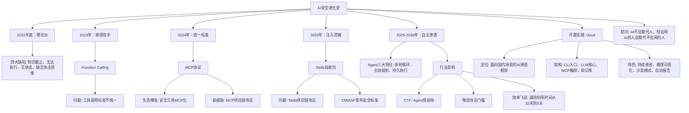

# AI 安全进化史：从理论派黑客到自主渗透的 Agent 战争

## 摘要

本文详细回顾了 AI 在网络安全领域，特别是渗透测试和 CTF 比赛中的进化历程。从 2022 年底 ChatGPT 刚发布时的“理论派”表现（充满幻觉、无法执行命令、缺乏攻击思维），到 2023 年通过 Function Calling 获得“双手”，再到 2024-2025 年借助 MCP 协议和 Skills 技能包实现自主规划、持续执行的 Agent 渗透。文章还深入探讨了由此带来的安全新挑战（MCP 和 Skills 供应链攻击），并介绍了作者开发的、面向国内安全场景的开源 AI 渗透测试框架 `cloud`，展示了 AI 如何从“不堪大用”进化到“干翻对抗”的实战水平。

## 目录

-   [AI 安全进化史：从理论派黑客到自主渗透的 Agent 战争](#ai-安全进化史从理论派黑客到自主渗透的-agent-战争)
-   [摘要](#摘要)
-   [目录](#目录)
-   [技术关键词](#技术关键词)
-   [核心要点](#核心要点)
-   [1. 混沌初开：2022 年底的 AI 安全“理论派”](#1-混沌初开2022-年底的-ai-安全理论派)
    -   [1.1 四大致命缺陷](#11-四大致命缺陷)
    -   [1.2 当时的 AI 更像一个“ND 黑客”](#12-当时的-ai-更像一个nd-黑客)
-   [2. 获得“双手”：2023 年的 Function Calling 与工具调用](#2-获得双手2023-年的-function-calling-与工具调用)
    -   [2.1 从“建议”到“执行”](#21-从建议到执行)
    -   [2.2 新的问题：工具调用的“巴别塔”](#22-新的问题工具调用的巴别塔)
-   [3. 统一标准：2024 年的 MCP 协议与生态爆发](#3-统一标准2024-年的-mcp-协议与生态爆发)
    -   [3.1 MCP 协议：AI 世界的 USB-C 接口](#31-mcp-协议ai-世界的-usb-c-接口)
    -   [3.2 安全工具链的 MCP 化](#32-安全工具链的-mcp-化)
    -   [3.3 繁荣背后的阴影：MCP 供应链攻击](#33-繁荣背后的阴影mcp-供应链攻击)
-   [4. 注入灵魂：2025 年的 Skills 技能包](#4-注入灵魂2025-年的-skills-技能包)
    -   [4.1 Skills 是什么？](#41-skills-是什么)
    -   [4.2 Skills 在渗透测试中的应用](#42-skills-在渗透测试中的应用)
    -   [4.3 Skills 的安全隐患](#43-skills-的安全隐患)
-   [5. 自主渗透：2025-2026 年的 AI Agent 实战](#5-自主渗透2025-2026-年的-ai-agent-实战)
    -   [5.1 真正 Agent 的三大特征](#51-真正-agent-的三大特征)
    -   [5.2 三个阶段对比](#52-三个阶段对比)
    -   [5.3 对行业的影响](#53-对行业的影响)
        -   [5.3.1 CTF 比赛：Agent 的竞技场](#531-ctf-比赛agent-的竞技场)
        -   [5.3.2 降低攻击门槛](#532-降低攻击门槛)
        -   [5.3.3 效率飞跃：从 32 天到 5 天](#533-效率飞跃从-32-天到-5-天)
-   [6. 实战框架：开源项目 `cloud`](#6-实战框架开源项目-cloud)
    -   [6.1 项目背景与定位](#61-项目背景与定位)
    -   [6.2 技术架构](#62-技术架构)
    -   [6.3 核心功能与特色](#63-核心功能与特色)
        -   [6.3.1 Skills 体系](#631-skills-体系)
        -   [6.3.2 工具与模型支持](#632-工具与模型支持)
        -   [6.3.3 特色设计](#633-特色设计)
-   [7. 总结与展望](#7-总结与展望)

## 技术关键词

AI 安全, 渗透测试, CTF, LLM Agent, MCP 协议, Skills, Function Calling, 供应链攻击, OWASP, 自主渗透, 开源框架

## 核心要点

-   **AI 安全能力进化**：从 2022 年底无法执行命令、充满幻觉的“理论派”，到 2026 年能自主规划、持续渗透、拿下靶场 root 权限的实战 Agent。
-   **三大技术里程碑**：**Function Calling** 让 AI 获得执行能力；**MCP 协议** 统一了工具调用标准，引爆生态；**Skills 技能包** 为 AI 注入了专家级知识和操作流程。
-   **新的安全战场**：MCP 和 Skills 的普及带来了严重的供应链安全问题，攻击者可利用其漏洞控制 AI 进行恶意操作，OWASP 已发布相关安全标准。
-   **行业格局重塑**：AI 正在拉低攻击门槛，加速漏洞利用速度（从平均 32 天压缩至 5 天），渗透测试报告生成时间缩短 50% 以上。
-   **开源实践**：作者开发的 `cloud` 项目是一个面向国内安全场景的 AI 渗透测试框架，集成了自主 Agent、MCP 编排、丰富的 Skills 库和 CTF 支持。

## 1. 混沌初开：2022 年底的 AI 安全“理论派”

2022 年底，ChatGPT 刚发布时，安全圈所有人都想知道它能不能帮忙挖漏洞。然而，当时的 AI 表现令人失望。

### 1.1 四大致命缺陷

-   **知识截止（幻觉问题）**：AI 只知道训练数据截止前的信息。询问一个 2023 年后的漏洞，它可能会编造一个不存在的 CVE 编号或错误的影响版本，看起来专业但经不起深挖。
-   **无法执行命令**：AI 能建议使用 Nmap 扫描端口、SQLMap 测试注入，但它自己无法执行这些命令。它像一个脑子里有无限编程知识，但“没有电脑”的人。
-   **无状态**：每次对话都是全新的开始，没有记忆和上下文，无法进行需要多步操作的持续性渗透测试。
-   **缺乏攻击思维**：早期的 GPT 更像一个防守方（蓝队），可以告诉你代码是否符合安全规范，但不会主动思考“如果我故意绕过这个检查会怎么样”。

### 1.2 当时的 AI 更像一个“ND 黑客”

他懂很多概念，读很多论文，能把安全理论讲得头头是道，但一到实战就露馅。询问他一个网站有没有漏洞，他能编一份不存在的漏洞清单；问他怎么绕过 WAF，他给的 payload 早就被各大厂商标记了。

## 2. 获得“双手”：2023 年的 Function Calling 与工具调用

2023 年中，OpenAI 推出了 Function Calling 功能，这是 AI 安全能力的第一个转折点。

### 2.1 从“建议”到“执行”

Function Calling 相当于给 AI 配了一台电脑，让它终于可以开始操作了。

| 以前（纯理论） | 现在（可执行） |
| :--- | :--- |
| 询问最新 CVE | 回答“我的知识截止到...” |
| 询问网站开放端口 | 回答“我无法直接扫描” |
| 询问如何测试 SQL 注入 | 给出理论建议或操作代码，需手动复制执行 |

| 现在（可执行） | 调用 API 查询最新漏洞库，返回实时数据 |
| :--- | :--- |
| 调用 Nmap 工具进行扫描，返回真实结果 | 调用 SQLMap 直接测试，返回测试结果 |

### 2.2 新的问题：工具调用的“巴别塔”

安全圈子兴奋起来，开始尝试将各种安全工具接入 AI。但很快发现新问题：每个平台的工具调用方式都不一样。OpenAI 有 OpenAI 的格式，Claude 有 Claude 的格式，国产模型又是另一套。工具无法通用，重复开发工作量巨大。

## 3. 统一标准：2024 年的 MCP 协议与生态爆发

这个问题摆在那里整整一年，直到 2024 年 11 月，Anthropic 发布了 MCP 协议。

### 3.1 MCP 协议：AI 世界的 USB-C 接口

MCP（Model Context Protocol，模型上下文协议）定义了一套统一的标准。就像 USB-C 接口统一了充电和数据传输一样，工具只需按照 MCP 标准开发一次，就能被所有支持 MCP 的 AI 模型调用。

```mermaid
graph LR
    A[AI 模型 A] --> B{MCP 协议};
    C[AI 模型 B] --> B;
    D[AI 模型 C] --> B;
    B --> E[工具 1 (Nmap)];
    B --> F[工具 2 (SQLMap)];
    B --> G[工具 3 (Burp Suite)];
    style B fill:#f9f,stroke:#333,stroke-width:2px
```

### 3.2 安全工具链的 MCP 化

MCP 在 AI 安全圈传播极快。以前要让 AI 做渗透测试，需要为每个模型单独对接 Nmap、SQLMap、Burp Suite 等工具，工作量巨大。现在，安全圈开始疯狂地在 MCP 生态中填充各种工具：

-   **Fetch**：发送 HTTP 请求，测试边界
-   **Chrome DevTools**：浏览器自动化，XSS 测试
-   **Burp Suite**：抓包重放
-   **JS Reverse**：逆向 JS 加密逻辑
-   **Frida MCP**：移动端 Hook
-   **ADB MCP**：控制安卓设备
-   **Jadx MCP**：反编译 APK
-   **IDAPRO MCP**：二进制逆向

### 3.3 繁荣背后的阴影：MCP 供应链攻击

2026 年 4 月，Ox Security 发布报告指出 MCP 协议存在架构级设计缺陷。黑客能利用漏洞接管 MCP 服务器，操控 AI 进行恶意操作。受影响服务器超过 20 万台，代码库超过 3.2 万个，SDK 下载量超过 1.5 亿次。AI 的工具调用管道，反过来也可能成为攻击者的跳板。

## 4. 注入灵魂：2025 年的 Skills 技能包

2025 年开始，Skills 的概念开始流行，解决了 AI 如何像专家一样工作的问题。

### 4.1 Skills 是什么？

Skills 是 AI 的“技能包”，每一个 Skill 都是一个预定义的能力模块，包含该领域的知识库、操作流程和最佳实践。AI 调用 Skill，就像人类阅读了一篇操作文档，然后按照文档指引去执行。

### 4.2 Skills 在渗透测试中的应用

-   **Recon Skill**：包含信息收集方法论、指纹库、探测顺序建议。
-   **Vulnerability Discovery Skill**：包含漏洞分析体系、测试优先级排序、验证方法论。
-   **WAF Bypass Skill**：包含各种 WAF 绕过技巧、编码方式、分割思路。

### 4.3 Skills 的安全隐患

2026 年 2 月，Snyk 对近 4000 个 AI Skills 进行扫描，结果超过 1/3 存在安全性问题，其中 1467 个有漏洞或恶意代码。给 AI 安装一个 Skill，本质上是让 AI 执行一段第三方提供的代码。如果 Skill 本身有问题，AI 可能在帮我们做危险的事，例如读取敏感数据、开后门、将 MCP 工具链变成攻击跳板。

OWASP 随后发布了 Agent Skill Top 10，列举了 Skills 相关的安全风险，包括不安全的来源、权限过度、Prompt 注入、数据泄露等。

## 5. 自主渗透：2025-2026 年的 AI Agent 实战

2025 年到 2026 年，真正的 AI Agent 开始改变安全行业。

### 5.1 真正 Agent 的三大特征

1.  **多轮自主循环**：不是一问一答，而是 AI 自己规划下一步，自己执行，自己评估结果，再自己判断继续推进。
2.  **主动规划并执行**：告诉它“对这个目标进行渗透测试”，它会自动拆解任务：信息收集 → 端口扫描 → 漏洞探测 → 漏洞利用 → 权限提升 → 生成报告。
3.  **持久化执行**：可以跑几十轮、上百轮，持续进行渗透，中途可以看到它的思考过程和每一步操作。

### 5.2 三个阶段对比

```mermaid
graph TD
    subgraph 阶段一：2023 年
        A1[用户：审计这段代码] --> B1[AI：这段代码存在XX问题，建议采取XX操作];
        B1 --> C1[结果：纯建议，什么也做不到];
    end

    subgraph 阶段二：2024 年
        A2[用户：扫描这个网站] --> B2[AI：调用Nmap扫描，发现开放端口];
        B2 --> C2{AI：是否继续进行漏洞扫描？};
        C2 -- 用户确认 --> D2[AI：继续扫描];
        C2 -- 用户拒绝 --> E2[结果：能执行，但每一步需人工批准];
    end

    subgraph 阶段三：2025-2026 年
        A3[用户：对目标进行渗透测试] --> F3[AI Agent 自主规划];
        F3 --> G3[Round 1: 信息收集];
        G3 --> H3[Round 2: 漏洞分析，命中CVE];
        H3 --> I3[Round 3: 漏洞验证，获取Shell];
        I3 --> J3[Round 4: 权限提升，拿到Root];
        J3 --> K3[自动生成报告 + POC];
        K3 --> L3[结果：自主执行，无需干预];
    end
```

### 5.3 对行业的影响

#### 5.3.1 CTF 比赛：Agent 的竞技场

CSA（云安全联盟）专门举办了 Agentic Automatic CTF 比赛，要求参赛者构建能自主解题的 AI Agent。甚至有论文将 AI 在安全 CTF 中的表现作为正式研究方向，标题直接叫做《The World's Top AI Agent for Security CTF》。

#### 5.3.2 降低攻击门槛

Check Point 的报告指出，AI 正在降低攻击门槛（Lower the barrier for entry），让低技能的攻击者（Low-skilled actors）更快放大攻击能力。以前需要多年经验积累的渗透动作，现在一个新人配合成熟的 Skill 库和 Agent 框架，就能把很多基础操作跑起来。

#### 5.3.3 效率飞跃：从 32 天到 5 天

Cloud Security Alliances 的研究表明，漏洞从公开披露到被利用的中位数时间，已从过去的约 32 天压缩到约 5 天。攻击方理解补丁、找相似漏洞、生成利用代码的速度被大幅压缩。在报告生成方面，CyberCORE 的数据显示，使用 AI 后，渗透测试报告生成时间平均缩短 50%，复制粘贴时间从 50%-70% 降至 16%-20%。

## 6. 实战框架：开源项目 `cloud`

### 6.1 项目背景与定位

作者发现现有 AI 渗透测试工具要么水土不服，要么是玩具，要么是脚本合集互相打架。因此，他开发了 `cloud`，一个面向国内安全场景的 AI 渗透测试 CLI 工具，也是一个 AI Agent 智能体，并特意增加了 CTF 功能。

### 6.2 技术架构

`cloud` 的技术架构分为三层：

-   **CLI 入口层**：使用 TypeScript 构建的交互界面，包含 9 个子命令和持续性渗透模式。
-   **LLM Agent 核心层**：包含 Agent Core 主循环、动态提示词系统（身份设定、核心契约、MCP 工具列表）和会话状态管理。
-   **MCP 编排层**：管理 11 个 MCP 服务，23 个工具定义，分为 P0、P1、P2 三个优先级。
-   **安全知识库与 Skills 体系层**：包含 138 个参考文档，20 个渗透 Skill，覆盖从信息收集到报告生成的全流程。

### 6.3 核心功能与特色

#### 6.3.1 Skills 体系

-   **7 个核心 Skill**：负责全流程编排和调度，包括 PenTest Flow、Recon、Vulnerability Discovery、Exploitation、Post Exploitation、Reporting、WAF Bypass。
-   **13 个专项 Skill**：覆盖 Web、Android、客户端逆向、AI MCP 安全、内网渗透、CTF 等细分领域。每个专项 Skill 包含多个实战经验沉淀的参考文档。

#### 6.3.2 工具与模型支持

-   **编解码工具**：内置 29 种编解码和加解密工具，包括 Base64、Base32、Base58、Hex、URL、HTML、Unicode、ROT13、Caesar、MD5、SHA 系列、AES、JWT 等，并支持自动解码。
-   **LLM 提供商**：支持 8 个模型提供商（OpenAI、MiniMax、DeepSeek、智谱、Moonshot、通义千问、SiliconFlow），并支持自定义配置，方便在不同场景下灵活切换。

#### 6.3.3 特色设计

-   **持续性渗透测试**：默认 100 轮对话一个周期，最多持续 10 个周期（共 1000 轮），内置死循环检测，避免资源浪费。
-   **推理可视化**：一键切换显示 AI 的思考过程，对调试和理解 AI 非常有帮助。
-   **沙盒模式**：内置安全提示词，约束 AI 行为，防止其进行过于激进的危险操作。
-   **自动报告与 POC 生成**：渗透测试结束后，自动输出 Markdown 格式报告和 Python POC 脚本，每一步操作都可审计、可回放。

## 7. 总结与展望

从两年前连 SQL 注入都打不明白，到如今能自主打穿靶场、拿下 Root 权限，AI 在网络安全领域的进化速度令人咋舌。AI 攻击队已达到中上游甚至一流实战水平，纯人工队伍逐渐不敌 AI 加持的队伍。

下一步，AI Agent 的自主渗透能力将继续提升，MCP 和 Skills 的安全标准将进一步完善。对于安全从业者而言，抗拒变化不如拥抱、理解并驾驭它。因为 AI 不会取代安全研究员，但会用 AI 的安全研究员会取代不会用的。

