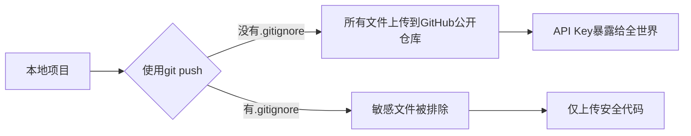
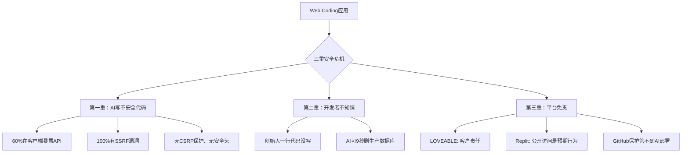
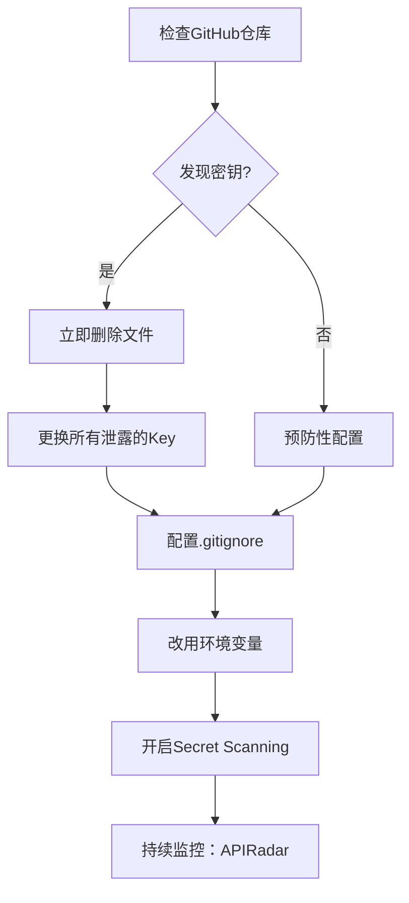

# GitHub上正在发生大规模API Key泄漏事件，小白需警惕！

## 摘要
- **核心主题**：GitHub上大量AI项目的API Key（密钥）被公开暴露，正在被爬虫和攻击者实时窃取。
- **主要问题**：AI降低了写代码的门槛，但安全知识门槛未降，导致大量新手将API Key硬编码在代码中并推送到公开仓库。
- **关键数据**：2026年GitGuardian统计了2800多万个硬编码密钥；仅2025年2月，研究人员发现了近1.2万个活着的DeepSeek API Key；AI编码工具产生的应用中有5000个几乎没有安全机制。
- **风险后果**：密钥泄露后，攻击者可滥用API服务（如调用大模型产生高额费用），甚至窃取项目中的敏感数据（如客户对话、商业文件）。
- **紧急建议**：立即检查自己的GitHub公开仓库，删除已泄露的密钥并更换；使用`.gitignore`、环境变量、GitHub Secret Scanning等防护措施。

## 目录
1. [事件起因：粉丝私信中的安全漏洞](#1-事件起因粉丝私信中的安全漏洞)
2. [GitHub密钥泄漏的规模与历史](#2-github密钥泄漏的规模与历史)
3. [AI编码工具带来的三重安全危机](#3-ai编码工具带来的三重安全危机)
4. [典型案例：MOTEBOOK的“零代码”翻车](#4-典型案例moteebook的零代码翻车)
5. [如何自查与防护](#5-如何自查与防护)
6. [思维导图](#6-思维导图)

## 技术关键词
- API Key、`.gitignore`、硬编码、环境变量、Secret Scanning、Push Protection、爬虫、SSRF、CSRF、CVE

---

## 1. 事件起因：粉丝私信中的安全漏洞

一位粉丝私信说，他的朋友的项目被安全机器人自动发现了问题。原因很简单：**没有配置`.gitignore`文件**，直接使用`git push`将整个项目推到了GitHub公开仓库，其中就包含大模型的API Key。

**什么是`.gitignore`？**
- `git` 是一个版本控制工具，用于将本地代码推送到GitHub。
- `.gitignore` 是一个“推送黑名单”文件。将不想上传的文件（如配置文件、环境变量、密钥等）写入其中，它们就不会被推送到远程仓库。

---

## 2. GitHub密钥泄漏的规模与历史

- **2026年数据**：GitGuardian统计，GitHub上共有**2800多万个硬编码密钥**暴露。其中AI服务的API Key同比增长了**81%**。
- **DeepSeek事件**：2025年1月，DeepSeek自己的ClickHouse数据库未加认证，100万条日志暴露；同年2月，研究人员在公开数据中找到了**近1.2万个仍活着的DeepSeek API Key**。
- **爬虫历史**：密钥爬虫早在**2015年**就已出现，一个叫`GROB`的工具专门扫描GitHub上的泄漏凭证。而GitHub直到**2024年**才默认开启Push Protection（推送保护），比爬虫晚了整整10年。

**为什么现在爆发？**
- **DeepSeek V3/V4等模型API价格极低**，吸引大量不会写代码的人涌入。
- **AI降低了写代码的门槛，但安全知识的门槛一点没降**。新手往往不知道密钥不能硬编码，直接将其写在代码里并推送。

---

## 3. AI编码工具带来的三重安全危机

Web Coding（AI辅助编码）存在三重严重问题：

### 第一重：AI写了不安全的代码，你不知道
- **60%的Web Coding应用在客户端就暴露了API**（例如前端代码中直接写API Key）。
- AI的训练数据中包含大量不安全的快捷写法，AI直接学了过去。
- 测试发现：五个主流AI编码工具（Claude Code、Codex、Cursor、Replit、Davin）产出的应用**100%存在SSRF漏洞**，15个测试应用没有一个有CSRF保护，没有一个设置了安全头。

### 第二重：你连自己的代码里有什么都不知道
- 比如MOTEBOOK的创始人公开说“我一行代码都没有写”。
- 如果你不审查AI生成的代码，你怎么知道Cursor和Claude Code能在9秒内删除你的生产数据库？（这是Pocket OS的真实案例）

### 第三重：平台的安全责任是推给你的
- 之前LOVEABLE被爆出CVE-2025-48757，170多个生产环境应用受影响。LOVEABLE提出异议，认为保护应用数据是**客户的责任**。
- Replit的CEO说：“公开应用可以被访问是预期行为。”
- **你以为平台帮你做了兜底，结果它的免责条款写得比你的代码还要严谨。**
- GitHub的Push Protection也管不到AI平台直接部署的应用（这些应用根本不会走git推送）。38万个被扫描的应用中大部分都是这种情况。

---

## 4. 典型案例：MOTEBOOK的“零代码”翻车

2026年2月，AI社交平台MOTEBOOK被安全公司披露：
- **150万个认证令牌泄露**
- **3.5万个邮箱暴露**
- 攻击方式只是简单的几行浏览器控制台脚本

最离谱的是：**创始人公开说过“我一行代码都没有写”**。你连自己的应用里有什么都不知道，怎么能保证安全？

> 真实数据：以色列安全公司Red Access扫描了公开网络上的Web Coding应用，共**38万个**。其中：
> - 5000个左右几乎没有安全机制
> - 2000个左右确认泄露私密数据（医生个人信息、广告采购数据、市场战略文件、客户完整对话记录）
> - 这还只是托管在AI平台自有域名上的，自己购买域名部署的可能更多

---

## 5. 如何自查与防护

### 立即行动
1. **去GitHub搜索你的用户名 + API key / secret / token 等关键词**，查看公开仓库里有没有`.env`或`config.json`文件。
2. **如果发现了，立即删除文件，并换掉你的Key**。注意：只是删除文件是不够的，**Key一旦泄露，就必须更换**。

### 防护措施
1. **使用`.gitignore`**：将`.env`、密钥文件等写入`.gitignore`。
2. **使用环境变量**：用环境变量代替硬编码。不要在代码里写`OpenAI API Key = "sk-xxxx"`。
3. **开启GitHub的Secret Scanning和Push Protection**：GitHub会自动检测并阻止已知类型的密钥被推送。
4. **记住原则**：**Key如果推到了GitHub上，就当它已经泄露了，赶紧换掉。**

### 实时监控
有一个网站叫**APIRadar**，实时监控GitHub上的Key泄漏。去看看那个滚动列表，**每秒都在更新**。这可不是危言耸听。

---

## 6. 思维导图

```mermaid
graph TD
    A[GitHub API Key泄漏事件] --> B[事件起因];
    B --> B1[粉丝私信：朋友项目未加.gitignore];
    B --> B2[密钥随代码推送至公开仓库];
    
    A --> C[数据规模];
    C --> C1[2026年：2800万+硬编码密钥];
    C --> C2[AI Key同比增81%];
    C --> C3[1.2万个活着的DeepSeek Key];
    
    A --> D[历史与原因];
    D --> D1[爬虫2015年已出现];
    D --> D2[GitHub保护2024年才默认开启];
    D --> D3[AI降低编码门槛，安全知识门槛未降];
    
    A --> E[三重安全危机];
    E --> E1[AI写不安全代码];
    E --> E2[开发者不知情];
    E --> E3[平台免责条款];
    
    A --> F[典型案例];
    F --> F1[MOTEBOOK：150万令牌泄露];
    F --> F2[创始人一行代码没写];
    F --> F3[38万Web应用，5000个无安全机制];
    
    A --> G[防护措施];
    G --> G1[自查：搜索用户名+API key];
    G --> G2[删除文件并换Key];
    G --> G3[配置.gitignore];
    G --> G4[使用环境变量];
    G --> G5[开启Secret Scanning];
    G --> G6[持续监控：APIRadar];
```

