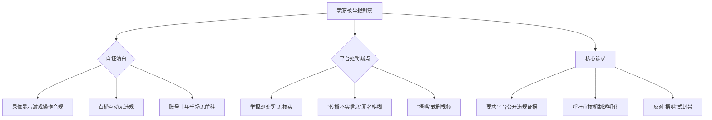

# 千场不封？游戏录像自证清白，揭露“传播不实信息”的真相

## 摘要
本文基于一段游戏录像，还原了玩家在遭遇举报后，因“传播不实信息”被平台处罚的全过程。视频通过时间线展示了关键游戏操作（如启动管道闸门、确认接应点、遭遇全副武装敌人等），以及直播中观众与主播的互动，最终引出核心争议：玩家在游戏内合规操作、直播内容无违规，却因举报被平台以“传播不实信息”为由封禁（账号已运营十年，游戏场次超千场）。文章旨在呼吁平台审核机制透明化，避免“捂嘴”式误判。

## 目录
- [摘要](#摘要)
- [核心观点](#核心观点)
- [技术关键词](#技术关键词)
- [事件还原：录像中的关键时间线](#事件还原录像中的关键时间线)
- [争议焦点：为何“千场不封”却因举报被罚？](#争议焦点为何千场不封却因举报被罚)
- [思维导图](#思维导图)

## 核心观点
1. **录像自证合规**：视频展示了玩家在游戏中的合法操作（启动供电开关、打开逃生窗口、确认接应点位置），无任何违规行为。
2. **直播内容无违规**：主播与观众（如“小超爱猛攻”“语硕”）的互动仅为游戏讨论，未涉及敏感或虚假信息。
3. **平台“捂嘴”逻辑**：玩家账号已运营十年、游戏场次超千场，却因举报被以“传播不实信息”封禁，质疑平台审核不透明、依赖举报而非事实。
4. **呼吁公平机制**：要求平台提供明确的违规证据，而非仅凭举报即处罚，避免“捂嘴”式处理。

## 技术关键词
- 游戏录像回放
- 直播互动
- 举报机制
- 平台审核
- 账号封禁

## 事件还原：录像中的关键时间线

### 1. 游戏操作阶段（00:00:22 – 00:04:14）
- **00:00:22 – 00:00:28**：玩家启动管道闸门供电开关，并打开逃生窗口，确认接应点位置。这是标准的游戏内解谜/逃脱流程。
- **00:00:34 – 00:00:38**：玩家操作时，背景传来“妈不演的呀”“神经啊”等感叹，反映对游戏内敌人行为的反应，属于正常游戏交流。
- **00:00:51 – 00:00:56**：玩家犹豫是否追击敌人，并提到“死了谁举报他”，暗示对游戏内举报机制的调侃。
- **00:00:58 – 00:01:00**：玩家判断“他妈铁铁挂啊”，预测敌人即将被击败，属于游戏策略分析。
- **00:01:19 – 00:01:22**：游戏内出现“大奖了”提示，随后“探测到全副武装的目标”，显示玩家遭遇高级敌人。
- **00:01:32 – 00:01:36**：玩家发现敌人装备“起点嗨”（可能指高等级装备），进一步确认游戏难度。
- **00:04:10 – 00:04:14**：管道闸门暂时关闭，玩家指令“随机应变，保持警觉”，继续应对游戏挑战。

### 2. 直播互动阶段（00:04:36 – 00:05:16）
- **00:04:36 – 00:04:40**：观众“on irene r”进入直播间。
- **00:04:40 – 00:04:43**：玩家认出观众“小超爱猛攻”和“语硕”，进行简单打招呼。
- **00:05:13 – 00:05:16**：玩家突然爆出核心质疑：“你妈的1000场都不封的呀”，直指游戏账号运营十年、场次超千场，却因举报被封，强烈表达不满。

## 争议焦点：为何“千场不封”却因举报被罚？

### 1. 玩家自证逻辑
- **长期合规记录**：账号已运营十年，游戏场次超千场，从未被永久封禁，说明玩家一直遵守游戏规则。
- **录像为证**：视频中所有操作均为游戏内合法行为，无外挂、辱骂、传播虚假信息等违规迹象。
- **直播内容透明**：直播互动仅涉及游戏讨论，无任何政治敏感、虚假宣传或恶意攻击。

### 2. 平台处罚疑点
- **举报即处罚**：玩家推测是因为游戏内被举报（如“死了谁举报他”中的调侃），平台未核实直接封禁。
- **“传播不实信息”罪名模糊**：玩家质疑该罪名缺乏具体证据——是传播了游戏内的不实信息？还是直播中说了什么？平台未给出明确解释。
- **“捂嘴”嫌疑**：玩家认为平台利用模糊规则压制异议，尤其是账号被多次删除（视频标题提到“删一遍我发一遍”），暗示平台试图掩盖争议。

### 3. 案例类比
想象你在一个论坛上发帖，内容是你玩游戏的正常操作截图，却被管理员以“造谣”为由删帖封号。管理员只说了“你违反了规则”，但不告诉你具体哪句话违规。这就是玩家遭遇的困境——**规则不透明，执行凭“感觉”**。

## 思维导图

## 结语
视频作者通过录像和直播记录，试图证明自己并未“传播不实信息”，而是遭遇了平台的误判或恶意举报。这一事件暴露出当前游戏平台审核机制的两大问题：**依赖举报而非事实**、**处罚理由模糊不清**。对于长期合规的玩家来说，这种“捂嘴”式处理不仅不公平，更会破坏社区信任。希望平台能认真审视个案，给出明确解释，而非简单“删一遍发一遍”。