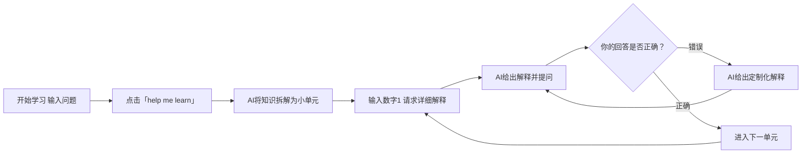
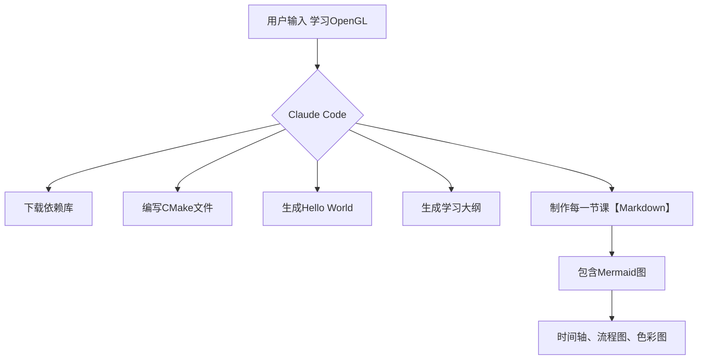
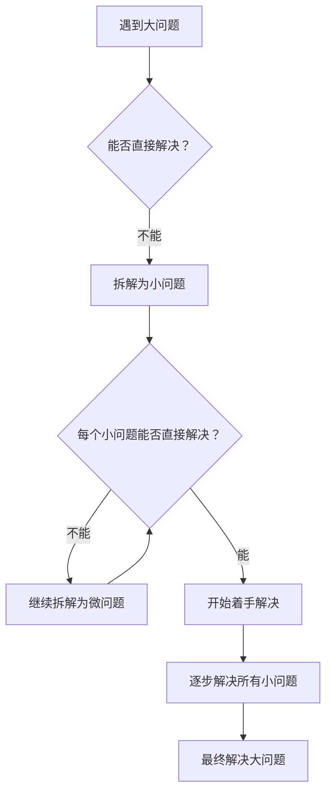
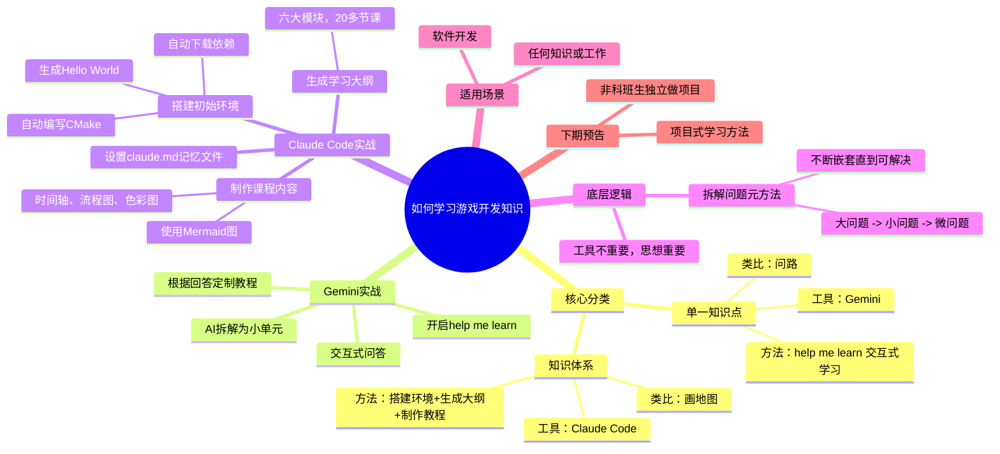

# 如何学习游戏开发知识：用AI拆解复杂知识，构建你的学习体系

## 摘要

很多人面对硬核知识（如游戏开发）时，常感到无从下手或似懂非懂。本文分享一套通用的学习方法，将知识分为“单一知识点”和“知识体系”两类，并分别借助AI工具（Gemini、Claude Code）进行高效学习。核心思想是**将大问题层层拆解为小问题**，直到可以解决为止。本文通过实战演示，展示了如何用AI交互式学习单一知识点，以及如何用AI搭建完整知识体系（如OpenGL）。最后，总结了这一“元方法”的底层逻辑，并预告了下一期更强大的项目式学习法。

## 目录

- [1. 核心观点：学习的两个关键分类](#1-核心观点学习的两个关键分类)
- [2. 方法一：用Gemini攻克单一知识点（如算法）](#2-方法一用gemini攻克单一知识点如算法)
- [3. 方法二：用Claude Code构建知识体系（如OpenGL）](#3-方法二用claude-code构建知识体系如opengl)
- [4. 底层逻辑：拆解问题的元方法](#4-底层逻辑拆解问题的元方法)
- [5. 总结与预告](#5-总结与预告)
- [6. 思维导图](#6-思维导图)

## 1. 核心观点：学习的两个关键分类

在学习任何新知识前，首先要明确你面对的是哪一类问题：

| 类型 | 描述 | 类比 | 推荐工具 |
|------|------|------|----------|
| **单一知识点** | 针对某个算法、思路、具体问题 | 在陌生城市问路，只需一个明确方向 | Gemini（启用「help me learn」模式） |
| **知识体系** | 针对工具、第三方库、完整框架 | 画一张城市地图，需逐步探索 | Claude Code（代码+大纲+教程） |

**技术关键词**：知识分类、单一知识点、知识体系、AI辅助学习、交互式学习

## 2. 方法一：用Gemini攻克单一知识点（如算法）

### 2.1 为什么选择Gemini？

Gemini网页聊天框提供了一个独特的 **「help me learn」** 功能，能将回答拆解为**循序渐进的小单元**，并以**交互式问答**形式推进学习。

### 2.2 实战演示：学习「自动寻路」算法

1. **打开Gemini网站**，在对话框中输入问题。
2. **点击「help me learn」**，启动引导式学习模式。
3. **AI将知识拆解为多个小单元**，先给出概括性概念。
4. **按照顺序输入数字（如1）** 请求详细解释。
5. **AI解释完后，会提出一个小测验**，你必须回答正确才能继续。
6. **根据你的回答，AI提供定制化教程**：
   - 回答错误 → AI给出针对性解释，引导你重新思考。
   - 回答正确 → AI引导进入下一单元，逐步深入。

**核心优势**：有问有答、逐步深入，远优于一次性灌输大量信息。

## 3. 方法二：用Claude Code构建知识体系（如OpenGL）

### 3.1 为什么选择Claude Code？

Claude Code可以**直接操作代码和文件**，非常适合学习需要搭建环境的工具或库。它能自动完成下载依赖、编写CMake、生成Hello World等繁琐步骤。

### 3.2 实战演示：学习OpenGL

#### 步骤1：搭建初始环境

1. 创建一个空文件夹（如 `NOGL`）。
2. 在终端中打开，输入 `claude` 启动Claude Code。
3. 让Claude推荐学习资源，它推荐了经典网站。
4. 请求它**直接搭建初始环境**：
   - 自动下载所有第三方依赖库。
   - 自动编写CMake文件。
   - 生成一个最基本的Hello World程序。
5. 用VS Code打开，直接运行，出现Hello World窗口。

#### 步骤2：生成学习大纲

1. 让Claude Code**制定学习大纲**，指定你的知识背景和要求。
2. AI自动生成**六大模块、20多节课**的详细大纲。
3. 大纲内容准确、结构清晰。

#### 步骤3：制作课程内容

1. 让Claude Code**制作第一节课**。
2. 生成的Markdown文件包含**文本形式的图表**。
3. 要求AI**使用Mermaid语言生成图表**（一种嵌入Markdown的图表语言）。
4. AI生成的图表包括：
   - **时间轴**：展示学习路径。
   - **流程图**：展示逻辑关系。
   - **彩色流程图**：更美观、更易理解。

#### 步骤4：设置自动记忆文件

为了让Claude Code记住你的偏好，可以创建一个 `claude.md` 文件，记录细节。AI可以自动生成这个文件，内容规范准确，以后每次开启Claude Code都会自动读取。

## 4. 底层逻辑：拆解问题的元方法

无论是使用Gemini还是Claude Code，底层逻辑都是一致的——**拆解问题**。这是一种**元方法**，或者说**第一性原理**：

1. 遇到任何问题 → 想办法**拆解**。
2. 把大问题拆解为**小问题**。
3. 看小问题能否解决？如果能 → 开始着手。
4. 如果依然不能 → 继续拆解为**更多微问题**。
5. 这个过程可以**不断循环嵌套**，直到碰到一个真正能理解或解决的问题。

**关键点**：工具并不重要（Gemini、Claude只是例子），**拆解思想**才是核心。这种方法不仅适用于软件开发，也适用于任何知识或工作。

## 5. 总结与预告

| 学习类型 | 推荐工具 | 核心方法 | 适用场景 |
|----------|----------|----------|----------|
| 单一知识点 | Gemini（help me learn） | 交互式问答、逐步深入 | 算法、思路、具体问题 |
| 知识体系 | Claude Code | 自动搭建环境、生成大纲、制作教程 | 工具、库、完整框架 |

**底层逻辑**：拆解问题 → 解决小问题 → 逐步构建完整知识。

**下期预告**：进一步展示层层拆解方法的威力，介绍**项目式学习方法**。掌握这套方法，非科班生也能独立做出高质量学习项目。

## 6. 思维导图

