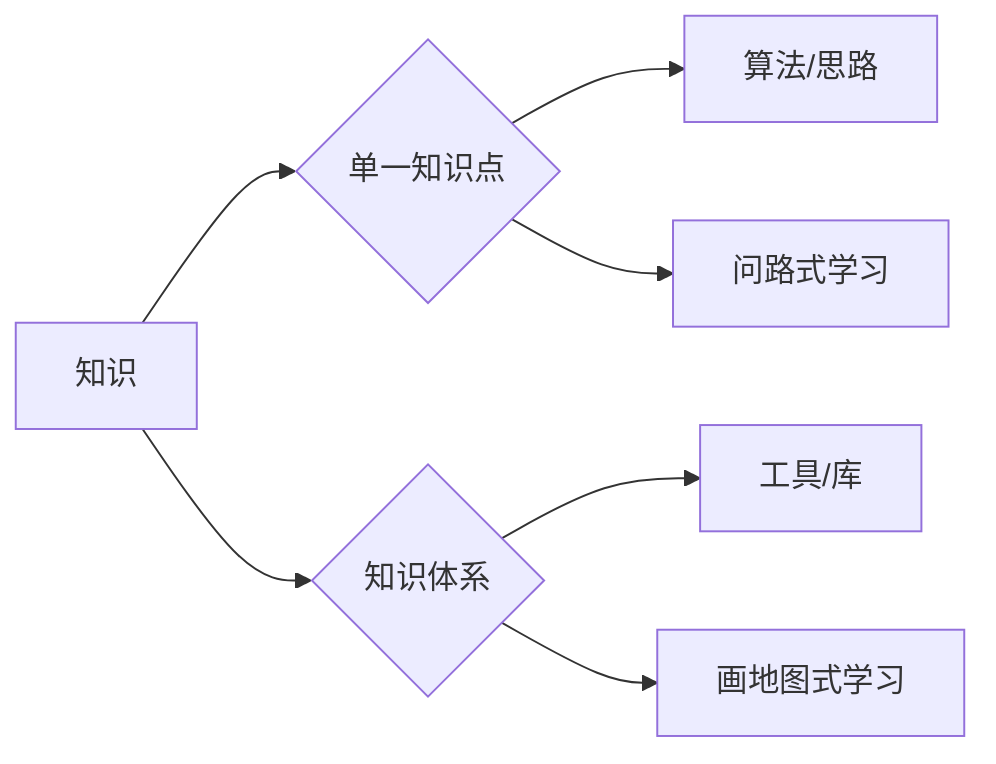
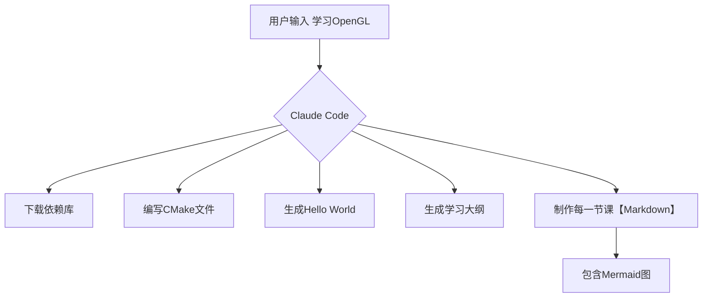
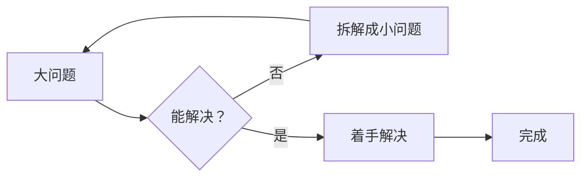
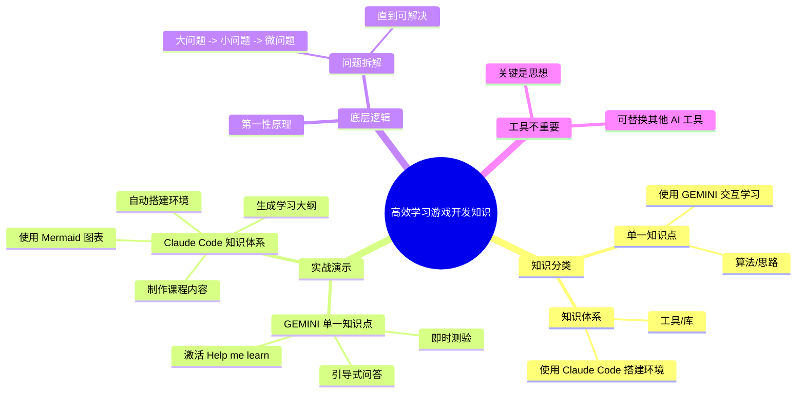

# 如何高效学习游戏开发知识：AI辅助下的拆解式学习法

## 摘要

本视频分享了作者本人一直在使用的、针对游戏开发（但通用）的高效学习方法。核心思想是将知识分为两类，并利用 AI 工具进行针对性学习，最终归结为**拆解问题**的第一性原理。

## 本章节技术关键词

- 单一知识点
- 知识体系
- AI 辅助学习
- 问题拆解
- 第一性原理
- GEMINI
- Claude Code
- Mermaid

## 核心内容提炼

1.  **知识分类**：将学习内容分为「单一知识点」和「知识体系」两种类型，分别采用不同的 AI 工具和策略。
2.  **单一知识点**：使用 GEMINI 的「Help me learn」交互模式，通过引导式问答、循序渐进的小单元和即时测验，实现深度理解。
3.  **知识体系**：使用 Claude Code 从零搭建项目环境、生成学习大纲和课程内容，并利用 Mermaid 图表将抽象概念可视化。
4.  **底层逻辑**：所有方法的本质是**问题拆解**——将大问题不断分解为可解决的小问题，直到能够着手处理。
5.  **工具是手段**：GEMINI 和 Claude Code 只是示例，关键是掌握拆解思想，可以替换为其他工具。

## 文章正文

### 一、 为什么学习新知识总是很吃力？

你总能看到各路大佬轻松搞定各种硬核知识技能，可一轮到自己，为什么在学习新知识时却总是感到很吃力？要么无从下手，要么似懂非懂。今天分享一套我自己一直在用的学习方法。虽然我专注于游戏开发，但是方法是通用的，能快速帮你搞定任何你想要掌握的知识或者技能。

### 二、 知识的两种类型

首先我们可以把知识分为两类：

- **单一知识点**：主要针对一些算法、思路等。例如「如何实现自动图怪」。这就像是在一个陌生的城市里问路，你只需要一个明确的方向就可以了。对于这类问题，我会使用 GEMINI 的网页聊天框进行学习。
- **知识体系**：复杂很多，主要针对某些工具或第三方库的用法。例如「如何使用 OpenGL」。这就像是画一张城市地图，你需要一步一步地探索，搞清楚城市的方方面面。对于这类问题，则依然是 Claude Code 的专长。

### 三、 实战演示：单一知识点学习（以 GEMINI 为例）

1.  **打开 GEMINI 网站**，在对话框中输入问题。
2.  **激活「Help me learn」模式**：点击下方的「Help me learn」按钮，进入引导式学习状态。
3.  **交互式学习**：GEMINI 会将知识拆分成多个循序渐进的小单元，并以交互式问答的形式呈现。
    - 它先讲一个概括性的概念，很好理解。
    - 然后你可以按照顺序输入「1」，它会针对第一个问题进行详细解释。
    - 解释完后，它会提供一个测验问题，你需要作答后才能继续学习。
    - 它会根据你的回答正确与否，提供更加定制化的教程。
4.  **示例**：比如输入「如何实现自动图怪」，GEMINI 会先解释概念，然后问「上下左右分别代表什么？」。回答错误（如看混方向）后，它会针对性纠正；回答正确后，引导进入下一步学习。

这种有问有答、逐步深入的学习方法，远远好于一口气给你一大段回答的方法。

### 四、 实战演示：知识体系学习（以 Claude Code 为例）

以学习 OpenGL 为例，步骤如下：

1.  **创建项目文件夹**：例如名为 `NOGL`。
2.  **通过终端启动 Claude Code**：输入 `claude`。
3.  **搭建初始环境**：Claude Code 可以自动下载所有第三方依赖库，编写 CMake 文件以及一个最基本的 Hello World 程序。你完全不需要操心任何环境配置问题。运行后，会出现一个 Hello World 窗口。
4.  **生成学习大纲**：让 Claude Code 根据你的知识背景和要求，生成一个学习大纲。例如，它可能会划分出六大模块，20 多节课。
5.  **制作课程内容**：让 Claude Code 制作第一节课。它会生成 Markdown 文件。
6.  **优化图表（Mermaid）**：为了让图片更清晰、美观，可以要求教程中多使用 Mermaid 图。Mermaid 是一种生成图表的语言，非常适合嵌入到 Markdown 中。生成后的效果包含时间轴、流程图等，自学完全够用。
7.  **创建配置文件**：可以创建一个 `claude.md` 文件记录一些细节，甚至可以直接让 Claude Code 帮我们写这个文件。以后开启 Claude 就会自动读取这个文件，使后续对话更规范。

### 五、 底层逻辑：问题拆解（第一性原理）

你会发现，虽然这节课用了 GEMINI 和 Claude Code，但它们是必须的吗？完全不是。工具并不重要，你完全可以换成其他的工具。但关键是你要使用这样的思想来解决问题。

这个思想就是**第一性原理**，或者说**问题拆解**：

- 碰到任何一个问题，都要想办法把它拆解。
- 把一个大问题拆解为小问题。
- 如果这个小问题依然无法解决，就继续往下拆解，把一个小问题变成更多的微问题。
- 这个拆解过程是可以不断循环嵌套的，直到我们碰到一个能够真正去理解或解决的问题，然后开始着手。

实际上不仅仅是软件开发，任何知识或者工作，都是可以遵循这样的原理来做的。

掌握了这样的方法，你也能自己独立做出类似的项目，甚至做得比我更好。

## 思维导图

