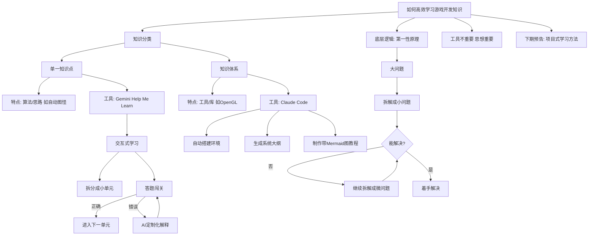

# 如何高效学习游戏开发知识：拆解与AI辅助实战指南

## 摘要

你是否也曾羡慕大佬轻松掌握硬核技能，而自己学习新知识时却总是无从下手或似懂非懂？本期视频分享了一套通用的学习方法，核心是将知识分为“单一知识点”和“知识体系”两类，并分别借助AI工具（Gemini 和 Claude Code）进行高效学习。更重要的是，视频揭示了这一切背后的底层逻辑——**第一性原理：层层拆解**。无论学什么，只要不断将大问题拆解为可解决的小问题，就能攻克任何难关。

## 目录

- [核心观点](#核心观点)
- [1. 知识分类与工具选择](#1-知识分类与工具选择)
  - [1.1 单一知识点：像问路一样简单](#11-单一知识点像问路一样简单)
  - [1.2 知识体系：像画地图一样系统](#12-知识体系像画地图一样系统)
- [2. 实战演示：单一知识点（Gemini + Help Me Learn）](#2-实战演示单一知识点gemini--help-me-learn)
- [3. 实战演示：知识体系（Claude Code + OpenGL）](#3-实战演示知识体系claude-code--opengl)
- [4. 底层逻辑：第一性原理——层层拆解](#4-底层逻辑第一性原理层层拆解)
- [5. 总结与预告](#5-总结与预告)
- [思维导图](#思维导图)

## 核心观点

1. **知识分为两类**：单一知识点（如算法思路）和知识体系（如工具/库的使用），学习方法不同。
2. **单一知识点**：用 Gemini 的 Help Me Learn 模式，实现交互式、循序渐进的学习。
3. **知识体系**：用 Claude Code 搭建项目环境，生成系统化大纲和带 Mermaid 图的教程。
4. **底层逻辑**：所有高效学习的本质都是“层层拆解”——将大问题拆成可解决的小问题。
5. **工具不重要**：关键是掌握拆解思想，任何AI工具都可以替换。

## 1. 知识分类与工具选择

### 1.1 单一知识点：像问路一样简单

- **定义**：针对某个具体的算法、思路或问题，例如“如何实现自动图怪”。
- **类比**：在陌生城市问路，只需要一个明确的方向。
- **推荐工具**：Gemini 网页聊天框（启用 “Help Me Learn” 模式）。

### 1.2 知识体系：像画地图一样系统

- **定义**：针对某个工具或第三方库的完整用法，例如“如何使用 OpenGL”。
- **类比**：画一张城市地图，需要逐步探索，搞清楚方方面面。
- **推荐工具**：Claude Code（终端命令行工具）。

## 2. 实战演示：单一知识点（Gemini + Help Me Learn）

1. **打开 Gemini 网站**，在对话框中输入问题。
2. **启用 “Help Me Learn” 模式**：点击对话框下方的按钮，进入引导学习状态。
3. **交互式学习**：Gemini 会将知识拆分成多个循序渐进的小单元，每次只讲一个概括性概念。
4. **答题闯关**：每个单元结束后，Gemini 会提出一个问题，用户需要作答才能继续。
   - 回答正确 → 进入下一单元，进一步深入学习。
   - 回答错误 → AI 会根据错误提供定制化解释，帮助理解后再继续。
5. **效果**：这种“有问有答、逐步深入”的方式远优于一次性抛出大量信息。

## 3. 实战演示：知识体系（Claude Code + OpenGL）

1. **创建项目文件夹**（如 `NOGL`），通过终端打开并输入 `claude`。
2. **搭建初始环境**：Claude Code 可以自动：
   - 下载所有第三方依赖库
   - 编写 CMake 文件
   - 生成一个最基本的 Hello World 程序（无需手动配置环境）
3. **生成学习大纲**：告知 Claude 自己的知识背景和需求，它会生成六大模块、20多节课的系统教程。
4. **制作带图表的教程**：
   - 默认生成的图片是文本形式，不够直观。
   - **进阶技巧**：要求 Claude 在教程中多使用 Mermaid 图表（一种嵌入 Markdown 的图表语言）。
   - 效果：生成包含时间轴、流程图、色彩丰富的图表，大大提升理解效率。
5. **创建项目配置文件**：让 Claude 自动生成 `claude.md` 文件，记录项目细节，下次启动时自动读取，保持学习连续性。

## 4. 底层逻辑：第一性原理——层层拆解

> **工具并不重要，关键是要使用这样的思想来解决问题。**

视频指出，无论是 Gemini 的交互式学习，还是 Claude Code 的系统化生成，其本质都是同一个底层方法：

- **遇到大问题** → 想办法拆解成小问题。
- **小问题仍无法解决** → 继续拆解成更微的问题。
- **不断循环嵌套** → 直到碰到一个真正能理解或解决的问题，然后着手解决。

这个拆解过程适用于任何知识领域或工作任务，不仅仅是软件开发。

## 5. 总结与预告

- **本期核心**：提供了一套结合AI工具的高效学习方法，并揭示了背后的“拆解”思想。
- **下期预告**：将进一步展示“层层拆解”方法的威力，并介绍作者自己正在用的**项目式学习方法**。
- **结语**：掌握这种方法，非科班生也能独立做出系列学习项目，甚至做得更好。

## 思维导图

