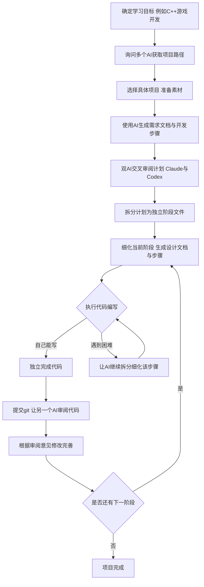

# 无师自通的项目式学习法：如何利用AI辅助独立完成编程项目

## 摘要

本文基于视频内容，系统梳理了在没有老师指导的情况下，如何利用AI工具（如Claude、Codex）独立完成一个编程实战项目（以C++游戏开发为例）的完整流程。核心思路是“层层拆解，循序渐进”，通过AI辅助制定路径、生成需求文档、拆分开发步骤、执行代码并交叉审阅，最终将一个大项目拆解为一个个可独立完成的小步骤。

## 目录

- [核心观点](#核心观点)
- [第一步：制定循序渐进的路径](#第一步制定循序渐进的路径)
- [第二步：选择项目并准备素材](#第二步选择项目并准备素材)
- [第三步：AI辅助生成需求文档与开发计划](#第三步ai辅助生成需求文档与开发计划)
- [第四步：双AI交叉审阅与优化计划](#第四步双ai交叉审阅与优化计划)
- [第五步：拆分计划，细化每个阶段](#第五步拆分计划细化每个阶段)
- [第六步：独立执行代码编写与AI辅助审阅](#第六步独立执行代码编写与ai辅助审阅)
- [第七步：遇到困难时继续拆分细化](#第七步遇到困难时继续拆分细化)
- [总结与思维导图](#总结与思维导图)

## 核心观点

1.  **项目式学习法的核心是“层层拆解，循序渐进”**：将一个大项目拆解为多个小阶段，每个阶段再拆解为具体步骤，直到每个步骤都能独立完成。
2.  **AI是辅助工具，不是替代品**：AI帮助你制定计划、审阅代码、提供指导，但核心的学习和编码仍需自己动手。
3.  **双AI交叉验证**：使用两个不同的AI工具（如Claude和Codex），一个负责执行，一个负责审阅，显著降低错误率和幻觉。
4.  **从宏观到微观**：先确定整体项目路径，再细化到每个阶段的设计文档、实现步骤和验收标准。
5.  **遇到困难时，先尝试拆分细化，而非直接让AI代写**：如果某一步不会，先让AI提供更详细的指导，自己尝试完成；实在卡住再让AI写，但事后应自己重写一遍以巩固学习。

## 第一步：制定循序渐进的路径

- **询问多个AI**：向Gemini、Claude等多个AI提问，例如“我想通过项目式学习C++游戏开发”，获取建议的项目列表。
- **综合考虑**：对比不同AI的建议，结合自己的基础（零基础或有经验）和兴趣，选择一条循序渐进的路径。例如，视频中提到了一个包含6个阶段的C++游戏开发路径。
- **确定起点**：零基础从第一个项目开始；有经验则从中选择合适项目。

## 第二步：选择项目并准备素材

- **选择具体项目**：从路径中选取一个项目，例如“制作一个平台跳跃游戏demo”。
- **准备游戏素材**：在itch.io等网站（搜索“game assets”）下载免费或付费的素材，如角色、地图等。

## 第三步：AI辅助生成需求文档与开发计划

- **创建inbox文件**：在项目仓库中创建一个`inbox`文件，写下你的初步想法，例如“我想制作一个平台跳跃游戏demo，使用CMake，技术栈包括XXX”。
- **使用Claude Code**：引用`inbox`文件，让AI给出学习建议和初步计划。
- **生成需求文档**：要求AI生成一份`requirements`（需求文档），明确项目边界、技术栈、功能等。
- **生成开发步骤**：要求AI生成一份`development steps`（开发步骤），将项目拆解为多个阶段（如12个阶段）。
- **个性化修改**：阅读文档后，提出自己的需求（如“我需要切换地图功能”、“存档读档功能”），让AI修改和完善计划。

## 第四步：双AI交叉审阅与优化计划

- **引入第二个AI**：使用另一个AI工具（如Codex），让它在执行前先对计划进行审阅（review）。
- **审阅内容**：Codex会检查计划是否合理，指出潜在的欠缺或不妥之处。
- **反馈与修改**：将Codex的审阅意见反馈给Claude，让Claude根据意见修改和完善开发计划。
- **关键原则**：两个AI角色可以互换（Claude执行、Codex审阅，反之亦然），核心是“两个agent互相验证”，降低同时出错的概率。

## 第五步：拆分计划，细化每个阶段

- **拆分长文档**：将包含所有阶段的完整计划文档拆分为一个索引文件（如`plan_index.md`）和每个阶段的独立计划文件（如`phase_01.md`、`phase_02.md`）。
- **引入编码设计规范**：在`plans/guides`文件夹中添加`design-guide.md`（设计规范）和`coding-guide.md`（编码规范），指导AI生成更符合要求的文档。
- **细化每个阶段**：让AI（如Codex）根据设计规范，对当前要执行的阶段进行详细拓展，生成包含以下内容的设计文档：
    - **实现思路**：相当于老师的指点。
    - **实现步骤**：1234567...依次列出的具体任务。
    - **验收标准**：完成后如何验证。

## 第六步：独立执行代码编写与AI辅助审阅

- **强烈建议自己写**：初学者应90%以上自己写代码，以真正掌握知识。
- **AI辅助审阅**：完成代码并提交git后，让另一个AI审阅代码，它会比较两次git提交的差异，给出修改建议。
- **根据建议修改**：仔细阅读审阅建议，修改完善代码。这是学习的好机会。
- **AI代写的特殊情况**：如果确实卡住，可以让AI写，但事后应自己重写一遍，以巩固学习。

## 第七步：遇到困难时继续拆分细化

- **不要直接求助**：如果某一步觉得难，第一步不是让AI代写，而是让AI继续对该步骤进行拆分细化。
- **获取详细指导**：让AI提供更详细的解释、伪代码或代码范例，直到你明白如何独立完成。
- **核心逻辑**：不断将困难步骤拆解为更小的、可独立完成的小步骤。

## 总结与思维导图

整个流程的核心逻辑就是**层层拆解，循序渐进**。无论AI工具如何演变，这个思路不变。通过项目式学习，你不仅能掌握知识，还能获得完成项目的巨大成就感。

