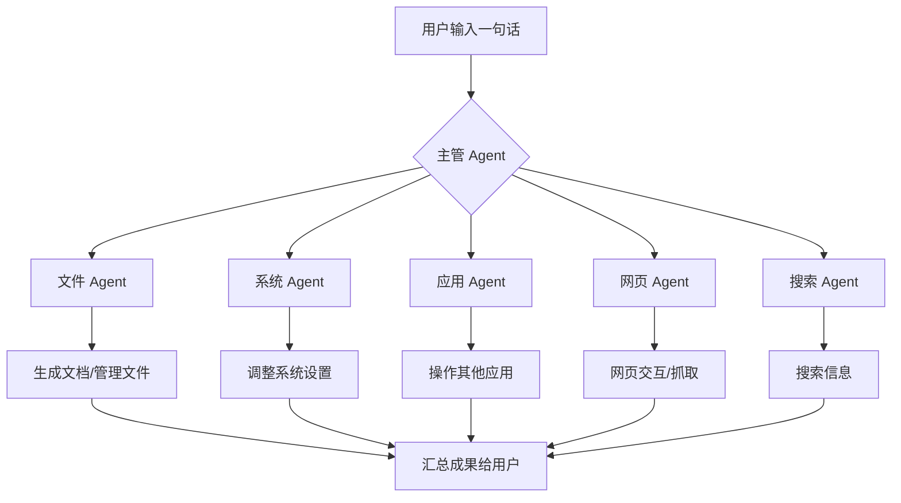
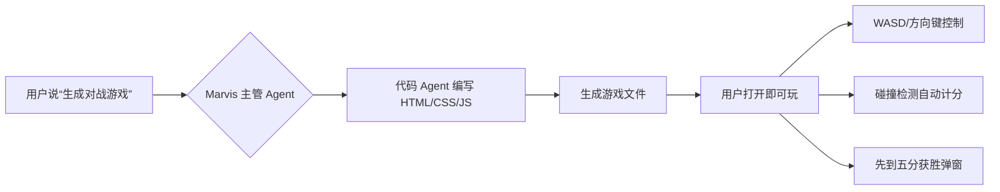
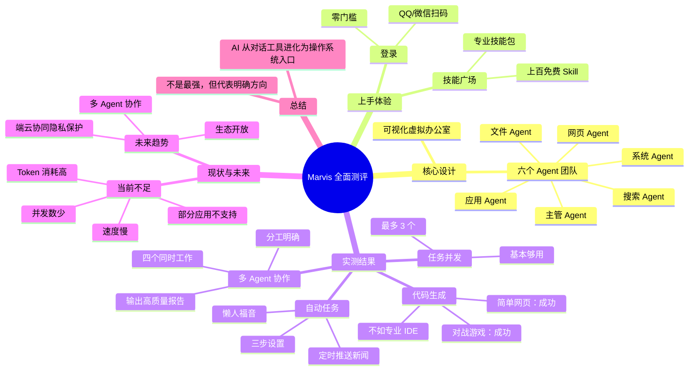

# Marvis 全面测评：AI Agent 团队协作，让六个“数字牛马”替你打工！

## 📌 核心观点

- **腾讯 Marvis 于 5 月 20 日全量上线**：无需邀请码、无需排队，直接下载即可使用，极大降低了用户门槛。
- **六个 Agent 组成 AI 团队**：一个主管 Agent 负责理解需求并拆解任务，五个专业 Agent（文件、系统、应用、网页、搜索）并行执行，实现 1+1>2 的协作效应。
- **可视化“虚拟办公室”**：空闲的 Agent 会打盹、喝咖啡、健身甚至上厕所，被派任务时立刻出现在工位，让冰冷的工具变得有温度。
- **实测亮点**：
  - **代码生成**：简单网页（随机数抽取）和像素风对战游戏均能一句话生成，虽不及专业 IDE，但对非编程用户极具价值。
  - **多 Agent 协作**：执行综合任务时，四个 Agent 同时工作，各自分工、互不干扰，输出结构清晰、来源明确的报告。
  - **自动任务**：支持定时自动执行（如每日新闻推送），设置简单，三步搞定，是追踪信息、监控竞品的懒人神器。
- **当前不足**：最多同时跑 3 个任务，操作速度偏慢，Token 消耗高，部分应用（如微信、支付宝）暂不支持。
- **未来趋势**：AI 正从对话工具进化为操作系统入口，多 Agent 协作、端云协同隐私保护是明确方向。

## 📖 文章目录

- [1. Marvis 是什么？六个 Agent 组成的 AI 团队](#1-marvis-是什么六个-agent-组成的-ai-团队)
- [2. 上手第一步：登录与技能广场](#2-上手第一步登录与技能广场)
- [3. 实测一：最多能同时跑几个任务？](#3-实测一最多能同时跑几个任务)
- [4. 实测二：Marvis 能写代码吗？](#4-实测二marvis-能写代码吗)
- [5. 实测三：多 Agent 协作的威力](#5-实测三多-agent-协作的威力)
- [6. 实测四：自动任务——懒人福音](#6-实测四自动任务懒人福音)
- [7. 总结：Marvis 的现状与未来](#7-总结marvis-的现状与未来)
- [8. 思维导图](#8-思维导图)

---

## 1. Marvis 是什么？六个 Agent 组成的 AI 团队

Marvis 是腾讯推出的一款多 Agent 协作平台，其核心设计是**用六个 AI Agent 模拟一个完整的数字团队**。

- **主管 Agent**：负责听懂你的需求，拆解任务并分配给对应的专业 Agent。
- **五个专业 Agent**：
  - **文件 Agent**：管理文件、文档生成、合同审查等。
  - **系统 Agent**：控制电脑系统设置。
  - **应用 Agent**：操作其他应用程序。
  - **网页 Agent**：与网页交互、抓取信息。
  - **搜索 Agent**：执行搜索任务。

**可视化设计**：在虚拟办公室中，空闲的 Agent 会打盹、喝咖啡、健身甚至上厕所。当你派发任务时，它们会立刻出现在工位上，让交互充满趣味性和人情味。

**技术关键词**：多 Agent 系统、任务拆解、并行协作、可视化交互、端云协同

## 2. 上手第一步：登录与技能广场

- **登录**：支持 QQ 和微信扫码登录，无需额外注册，对国内用户零门槛。
- **技能广场**：这是 Marvis 最被低估的隐藏宝藏。内有**上百个免费 Skill**，相当于给每个 Agent 装上专业技能包。例如：
  - 文档写作
  - 合同审查
  - 数据分析
  - PPT 生成
  - 大数据工作流
  - 大部分免费，一键安装即可使用。

有了 Skill 加持，Agent 不再是只会操作电脑的工具人，而是能输出专业成果的专家。

## 3. 实测一：最多能同时跑几个任务？

- **测试方法**：不断创建新任务。
- **结果**：到第四个任务时，系统提示“已达到上限”。
- **结论**：目前最多同时跑 3 个任务。对于绝大多数人的日常使用基本够用，后续若能放开到 5 个甚至更多，效率将再上一个大台阶。

## 4. 实测二：Marvis 能写代码吗？

### 4.1 简单测试：随机数抽取网页

- **指令**：“帮我生成一个网页，功能是随机抽取 1~100 之间的一个数字，页面要好看一点。”
- **结果**：成功生成 HTML 文件。页面有清晰标题、大大的“抽取”按钮，点击后随机跳出数字，效果流畅。
- **评价**：功能虽不复杂，但对非编程工具来说，代码生成能力超出预期。

### 4.2 进阶测试：像素风对战游戏

- **指令**：“帮我做一个像素风格的简单对战游戏网页。两个玩家分别用 WASD 和方向键控制角色移动，碰到对方就得分，先到五分的人赢。”
- **结果**：成功生成游戏文件。WASD 和方向键分别控制，碰到对方自动积分，先到五分弹窗提示获胜。
- **评价**：涉及游戏逻辑、键盘事件监听、碰撞检测，对非编程工具是很大考验，但 Marvis 完成了。虽然只是简单像素风，但作为一句话生成的游戏已经非常不错。

**客观评价**：Marvis 的编程能力与专业编程 IDE（如 Claude Code）相比仍有差距，复杂大型项目吃力，但**简单的网页小工具、自动化脚本完全可以胜任**。对不会写代码的普通用户来说，说一句话就能得到一个能用的东西，已非常有价值。

## 5. 实测三：多 Agent 协作的威力

- **秘诀**：指令要足够详细，把任务拆解清楚，让主管 Agent 知道如何分配工作。
- **实测**：执行综合任务时，**四个 Agent 同时工作**，各自干各自的活，互相配合、互不干扰。每条数据都标注来源，结构清晰，排版专业。
- **意义**：你不需要自己搜资料、写报告、做文档，一句话下去，四个“数字牛马”同时搬砖，你只需等着收成果。

**万能提示词模板**（已发在评论区）：通过合理拆解任务，可以最大限度调动六个 Agent，提高输出质量。

## 6. 实测四：自动任务——懒人福音

- **设置**：设定时间、描述任务、点击确定，三步搞定。
- **示例**：设置每天早上搜索最近重要新闻并推送。
- **结果**：三条新闻均有来源、有摘要、有发布时间，质量不错。
- **应用场景**：追踪行业动态、监控竞品信息、追踪某话题进展。设好自动任务，就不用每天手动搜索，Marvis 会定时搞定。

## 7. 总结：Marvis 的现状与未来

### 最真实的感受

- **明确趋势**：AI 正从对话工具进化为操作系统入口。从“跟你说话”变成“直接动手帮你干活”——整理文件、管理电脑、跨应用操作、自动化任务，这些日常工作中的效率黑洞，Marvis 正在填补。
- **当前不足**：
  - 操作速度偏慢
  - Token 消耗高
  - 部分应用（如微信、支付宝）暂不支持
  - 最多同时跑 3 个任务
- **技术问题可迭代优化**：这些都是可以通过迭代解决的。
- **更值得关注的方向**：
  - **多 Agent 团队协作**：六个 Agent 各司其职、并行工作，比一个万能 Agent 做所有事效率更高。
  - **端云协同隐私保护**：隐私模式下，本地模型也能干很多活，不需要把所有敏感数据交到云端。这对企业用户和有隐私需求的场景是刚需。
- **未来展望**：随着 MCP 生态开放更多专业 Skill、任务并行数放开，多 Agent 协作的生产力将呈指数级增长。

**一句话总结**：Marvis 可能不是现在最强的 AI，编程能力也不如 Claude Code，但**未来的趋势就是 AI 能帮你干越来越多的活**。Marvis 的多 Agent 协作模式，正是这一趋势的典型代表。

## 8. 思维导图

