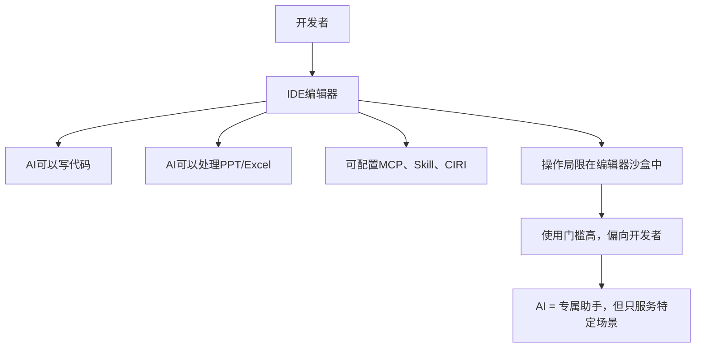
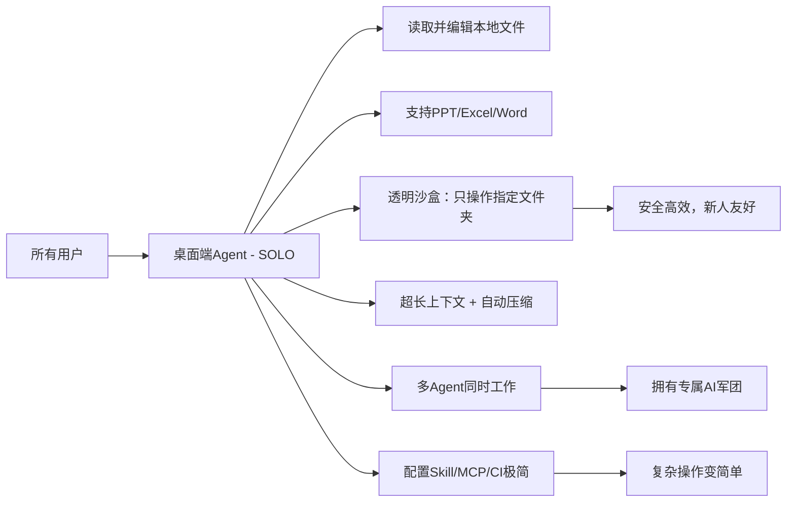
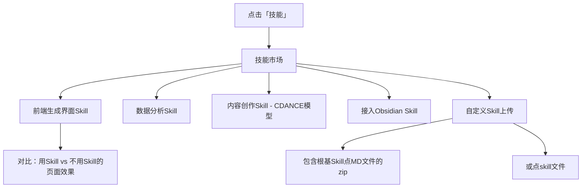

# SOLO模式为何从TRAE中独立出来？深度评测桌面端Agent的进化之路

> **摘要**：本文深入解析了字节跳动为何将TRAE中的SOLO模式独立成新应用，并全面评测了这款桌面端Agent的独特优势。文章从AI交互形态的演变（Chat UI → IDE UI → 桌面端Agent）切入，对比了各阶段的局限性，重点展示了SOLO在文件管理、浏览器自动化、跨文件数据处理及高阶技能配置等方面的实战能力，揭示了其“透明沙盒”安全机制与多Agent协同工作的革命性体验。

---

## 目录

- [视频核心观点](#视频核心观点)
- [技术关键词](#技术关键词)
- [一、AI交互形态的三次进化](#一ai交互形态的三次进化)
  - [1.1 Chat UI：顾问时代](#11-chat-ui顾问时代)
  - [1.2 IDE UI：专属助手时代](#12-ide-ui专属助手时代)
  - [1.3 桌面端Agent：透明沙盒时代](#13-桌面端agent透明沙盒时代)
- [二、SOLO实战评测：全能办公助手](#二solo实战评测全能办公助手)
  - [2.1 文件管理：一键整理下载文件夹](#21-文件管理一键整理下载文件夹)
  - [2.2 浏览器自动化：智能抓取与文档生成](#22-浏览器自动化智能抓取与文档生成)
  - [2.3 跨文件数据处理：从Excel到PPT的完整链路](#23-跨文件数据处理从excel到ppt的完整链路)
- [三、高阶玩法：Skill、MCP与CI的极简配置](#三高阶玩法skillmcp与ci的极简配置)
- [四、总结与思维导图](#四总结与思维导图)

---

## 视频核心观点

1. **AI交互形态经历了三阶段进化**：从只能对话的Chat UI，到专为开发者设计的IDE UI，再到面向所有人的桌面端Agent。每次进化都降低了使用门槛，扩大了应用场景。
2. **桌面端Agent的核心优势**：透明沙盒机制（只操作指定文件夹，而非全盘授权），支持多Agent并行工作，拥有超长上下文且能自动压缩文件。
3. **SOLO独立出来的关键原因**：为了提供更纯粹、更通用的桌面端Agent体验，不再局限于IDE场景，让非开发者也能轻松使用AI处理日常办公任务。
4. **实战能力验证**：文件整理、浏览器自动化、跨Excel数据分析和PPT/可视化网页生成，均表现出色，但PPT排版仍有提升空间。
5. **生态扩展性**：通过Skill市场、MCP协议和CI集成，用户可以像搭积木一样扩展SOLO的能力，甚至接入钉钉、飞书等企业工具。

---

## 技术关键词

`桌面端Agent` `SOLO` `TRAE` `Chat UI` `IDE UI` `透明沙盒` `MCP` `Skill` `CI` `浏览器自动化` `跨文件数据处理` `多Agent协同` `上下文压缩`

---

## 一、AI交互形态的三次进化

### 1.1 Chat UI：顾问时代

最早期，我们与AI的交互仅限于一个简单的对话框。


**痛点**：
- 无法直接操作本地文件（PPT、Excel等）
- 上下文长度有限，无法处理复杂任务
- 上传文件数量受限
- 修改内容需要手动复制粘贴

### 1.2 IDE UI：专属助手时代

随后，AI被集成到IDE（集成开发环境）中，如Cursor、VS Code等。



**痛点**：
- 使用门槛较高，不适合新手小白
- 所有操作都局限在编辑器沙盒中，无法操作系统级文件
- 更像一个专属助手，而非通用办公工具

### 1.3 桌面端Agent：透明沙盒时代

SOLO、CodeX等桌面端Agent的出现，标志着一个新时代的到来。



**核心优势**：
- **透明沙盒机制**：与小龙虾等工具不同，SOLO只操作你指定的文件夹，而非获取所有文件权限，既安全又高效。
- **超长上下文**：即使文件再多，也能自动压缩处理，无需担心上下文溢出。
- **多Agent协同**：你可以让多个Agent同时干活，相当于拥有了一支专属AI军团。
- **配置极简**：在桌面端Agent中，配置Skill、MCP、CI等原本复杂的操作，变得极其简单高效。

**与「小龙虾」的区别**：
| 特性 | 小龙虾 | 桌面端Agent |
|------|--------|-------------|
| 权限范围 | 获取所有文件权限 | 只操作指定文件夹 |
| 安全性 | 较低 | 较高，透明沙盒 |
| 使用门槛 | 中等 | 极低，新人友好 |

---

## 二、SOLO实战评测：全能办公助手

SOLO的界面标语是「More than coding」，它确实做到了多场景办公任务全覆盖。

### 2.1 文件管理：一键整理下载文件夹

**任务**：整理杂乱的下载文件夹，生成Excel清单，标记出重复文件和建议删除的文件。

**操作过程**：
1. 指定下载文件夹
2. 下达指令：「整理这个文件夹，生成一个Excel清单，标记出重复文件和建议删除的文件」
3. SOLO自动调用自身内置的Excel处理技能
4. 快速完成整理并生成清单

**结果**：
- 文件被清晰分类：图片、视频、音频、Mockup文件夹、Skill配置等
- 每个文件的状态一目了然
- **适用场景**：设计师整理下载的图片、老师整理课件或题目，非常方便

### 2.2 浏览器自动化：智能抓取与文档生成

**任务**：让SOLO去GitHub上搜索最近七天的优质项目，每个项目生成一个Markdown文档。

**操作过程**：
1. 下达指令：「去GitHub上搜索最近七天的优质项目，每个项目生成一个MD文档」
2. SOLO自动打开浏览器
3. 进行页面抓取和数据处理
4. 生成结构化的Markdown文档

**生成的文档结构示例**：
```
# 项目名称：HarmonAgent
## 核心亮点
## 技术栈
## 快速安装
```

**优势**：比直接去GitHub看英文页面更快、更高效，信息结构化且易于理解。

### 2.3 跨文件数据处理：从Excel到PPT的完整链路

**任务**：对五个Excel表格（包含四个月的三颗门牙无线耳机数据 + 无线蓝牙耳机竞品数据）进行分析，生成PPT大纲、可视化页面以及Excel方案。

**操作过程**：
1. 指定五个Excel文件
2. 下达指令：「对Excel表格的数据进行分析，生成PPT大纲、可视化页面以及Excel方案」
3. SOLO自动加载Excel处理技能
4. 输出三个成果

**成果展示**：

| 成果 | 内容 | 评价 |
|------|------|------|
| **数据分析报告** | 竞品数据、市场价格分布、用户亮点和痛点；自有数据总体趋势、增长和异常点；对比结论分析 | 非常详细，逻辑清晰 |
| **可视化网页** | 交互式图表，展示数据趋势和对比 | 图表质量非常高，可视化效果好 |
| **PPT大纲** | 可直接用于生成PPT的结构化大纲 | 内容参考价值高 |
| **生成的PPT** | 基于大纲生成的演示文稿 | 排版和数据可视化中等水平，需二次修改 |

**交互亮点**：
- 支持对图表进行评论和修改
- 可点击「添加到聊天框」进行迭代修改
- 如果配置了钉钉CIRI或飞书CI，可以直接将PPT或Excel发送到企业通讯工具

---

## 三、高阶玩法：Skill、MCP与CI的极简配置

SOLO的技能市场提供了丰富的预置Skill：



**Skill示例**：
- **前端生成界面Skill**：显著提升页面生成质量
- **数据分析Skill**：自动化数据处理流程
- **内容创作Skill**：基于CDANCE模型，从文字提示、图像或参考素材生成视频
- **Obsidian集成Skill**：与笔记工具联动
- **自定义Skill**：支持上传包含根基Skill点MD文件的zip或点skill文件

---

## 四、总结与思维导图

SOLO从TRAE中独立出来，标志着AI从「编程辅助工具」向「通用桌面办公Agent」的进化。它通过透明沙盒、超长上下文、多Agent协同和极简配置，真正实现了「More than coding」的愿景。

### 思维导图

```mermaid
graph TD
    A[SOLO独立出来] --> B[AI交互形态进化];
    B --> B1[Chat UI：顾问时代];
    B --> B2[IDE UI：专属助手时代];
    B --> B3[桌面端Agent：透明沙盒时代];
    
    A --> C[核心优势];
    C --> C1[透明沙盒：只操作指定文件夹];
    C --> C2[超长上下文 + 自动压缩];
    C --> C3[多Agent协同工作];
    C --> C4[配置极简：Skill/MCP/CI];
    
    A --> D[实战能力];
    D --> D1[文件管理：整理下载文件夹];
    D1 --> D1a[生成Excel清单];
    D1 --> D1b[标记重复/建议删除];
    D --> D2[浏览器自动化：GitHub项目抓取];
    D2 --> D2a[自动打开浏览器];
    D2 --> D2b[生成结构化MD文档];
    D --> D3[跨文件数据处理：Excel到PPT];
    D3 --> D3a[数据分析报告];
    D3 --> D3b[可视化网页];
    D3 --> D3c[PPT生成与修改];
    
    A --> E[高阶玩法];
    E --> E1[技能市场：预置Skill];
    E --> E2[自定义Skill上传];
    E --> E3[MCP协议集成];
    E --> E4[CI集成：钉钉/飞书];
    
    A --> F[适用人群];
    F --> F1[设计师：整理素材];
    F --> F2[老师：整理课件/题目];
    F --> F3[运营/市场：数据分析];
    F --> F4[开发者：快速原型];
    F --> F5[所有人：日常办公];
```



**最终结论**：SOLO的独立不是简单的功能拆分，而是对AI应用形态的一次重新定义。它让AI从「只能看」的顾问，进化到「能动手」的助手，最终成为「能协同」的伙伴。对于非技术用户来说，这是目前最友好、最安全的AI桌面端Agent之一。