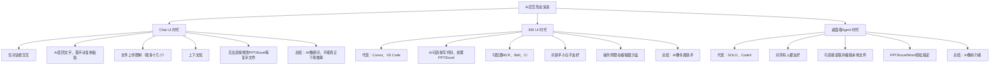
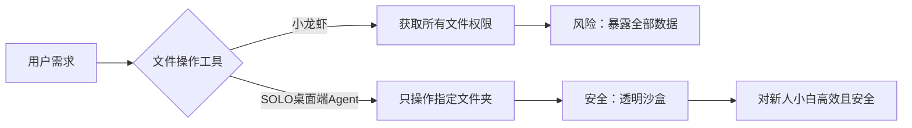
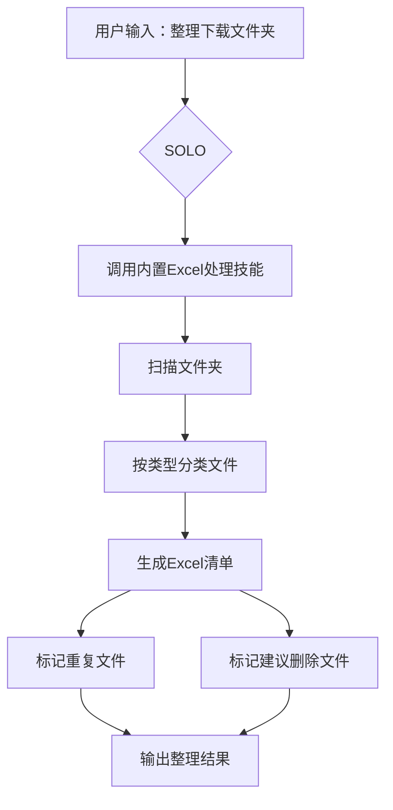
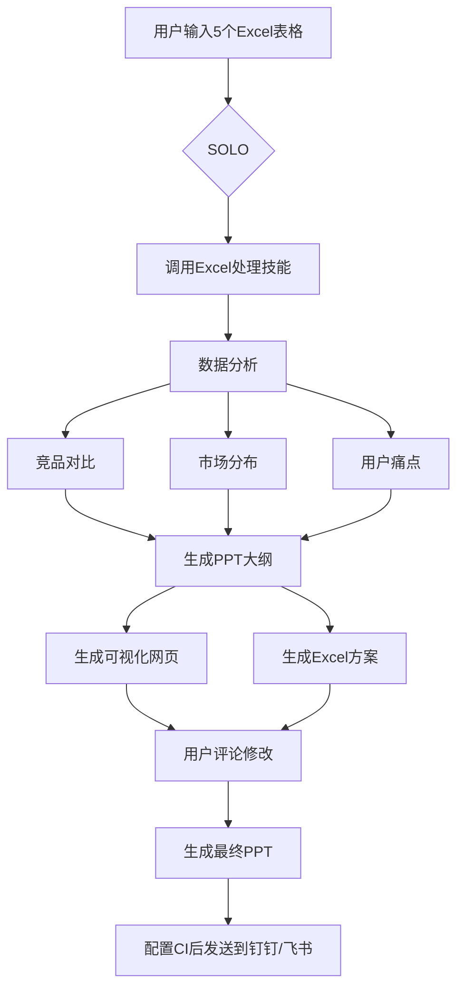
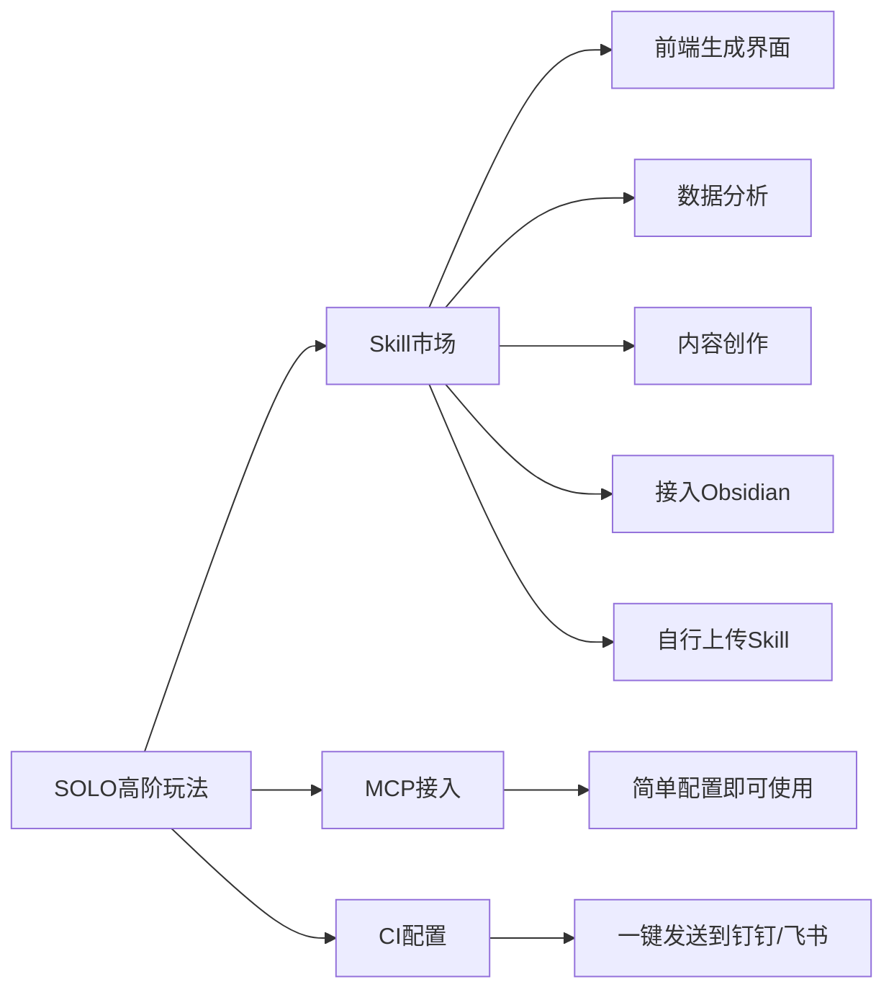
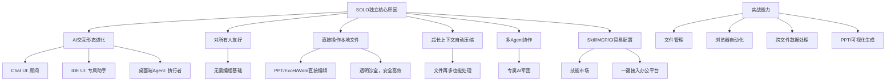

# SOLO模式为何从TRAE独立？桌面端AI Agent的进化与实战评测

## 摘要
本文深入探讨字节跳动将TRAE中的SOLO模式独立为全新桌面端Agent的原因。从AI交互形态的演进（Chat UI → IDE UI → 桌面端Agent）出发，分析SOLO的核心优势：对非开发者友好、本地文件直接编辑、超长上下文、多Agent协作、以及Skill/MCP/CI配置的简易化。通过文件整理、浏览器自动化、跨文件数据处理等真实场景评测，展示SOLO如何让AI从“顾问”变为“执行者”。

## 目录
- [SOLO为何独立？AI交互形态的三大进化阶段](#solo为何独立ai交互形态的三大进化阶段)
  - [1. Chat UI 时代：AI是“顾问”](#1-chat-ui-时代ai是顾问)
  - [2. IDE UI 时代：AI是“专属助手”](#2-ide-ui-时代ai是专属助手)
  - [3. 桌面端Agent 时代：AI是“执行者”](#3-桌面端agent-时代ai是执行者)
- [SOLO vs 传统方案：关键差异](#solo-vs-传统方案关键差异)
- [实战评测：SOLO的三大核心能力](#实战评测solo的三大核心能力)
  - [1. 文件管理：自动整理与生成Excel清单](#1-文件管理自动整理与生成excel清单)
  - [2. 浏览器自动化：GitHub项目搜索与文档生成](#2-浏览器自动化github项目搜索与文档生成)
  - [3. 跨文件数据处理：从Excel到PPT与可视化](#3-跨文件数据处理从excel到ppt与可视化)
- [高阶玩法：Skill、MCP与CI接入](#高阶玩法skillmcp与ci接入)
- [总结与思维导图](#总结与思维导图)

## 技术关键词
- 桌面端Agent、Chat UI、IDE UI、MCP、Skill、CI、沙盒、上下文压缩、多Agent协作、本地文件编辑、浏览器自动化、跨文件数据处理、PPT生成、Excel分析、可视化

---

## SOLO为何独立？AI交互形态的三大进化阶段

视频中清晰梳理了AI交互形态的演进路径，这正是理解SOLO独立价值的核心线索。

### 1. Chat UI 时代：AI是“顾问”
- **交互方式**：仅通过对话框，用户抛问题，AI回文字。
- **痛点**：
  - 修改需手动复制粘贴。
  - 文件上传限制（最多十几个）。
  - 上下文长度短。
  - 无法直接编辑PPT、Excel等复杂文件。
- **结论**：AI只能提供建议，无法实际执行任务。

### 2. IDE UI 时代：AI是“专属助手”
- **代表产品**：Cursor、VS Code。
- **进步**：AI可以写代码、处理PPT/Excel，支持MCP、Skill、CI配置。
- **痛点**：
  - 使用门槛高，偏向开发者。
  - 所有操作局限在编辑器沙盒中。
- **结论**：AI能力增强，但仅限于特定领域用户。

### 3. 桌面端Agent 时代：AI是“执行者”
- **代表产品**：SOLO、CodeX。
- **核心优势**：
  - 对所有人友好，无需编程基础。
  - 直接读取并编辑本地文件（PPT、Excel、Word）。
  - 超长上下文，自动压缩处理。
  - 支持多Agent同时工作（专属AI军团）。
  - Skill、MCP、CI配置极其简单高效。
- **结论**：AI真正成为“执行者”，能直接操作你的电脑。

## SOLO vs 传统方案：关键差异

视频中特别澄清了SOLO与“小龙虾”等文件权限工具的区别：

| 特性 | 小龙虾 | SOLO（桌面端Agent） |
|------|--------|---------------------|
| 文件权限 | 获取所有文件权限 | 只操作你指定的文件夹 |
| 安全性 | 较低，可能暴露全部数据 | 高，透明沙盒 |
| 适用人群 | 开发者 | 所有人（包括小白） |
| 操作复杂度 | 配置繁琐 | 简单高效 |

## 实战评测：SOLO的三大核心能力

### 1. 文件管理：自动整理与生成Excel清单

**场景**：整理杂乱的下载文件夹，生成Excel清单，标记重复文件和建议删除文件。

**操作流程**：
- 用户指定目标文件夹。
- SOLO调用自身内置的Excel处理技能。
- 自动扫描文件，按类型分类（图片、视频、音频等）。
- 生成清晰的Excel清单，包含重复文件标记和删除建议。

**效果**：非常适合设计师整理下载的图片、老师整理课件或题目。

### 2. 浏览器自动化：GitHub项目搜索与文档生成

**场景**：在GitHub上搜索最近7天的优质项目，为每个项目生成Markdown文档。

**操作流程**：
- SOLO自动打开浏览器。
- 在GitHub进行搜索和抓取。
- 自动为每个项目生成结构化文档（含核心亮点、技术栈、快速安装等）。

**效果**：比人工浏览英文GitHub页面更快速、高效，生成文档质量高。

### 3. 跨文件数据处理：从Excel到PPT与可视化

**场景**：对5个Excel表格（含竞品数据、销售数据）进行分析，生成PPT大纲、可视化页面和Excel方案。

**操作流程**：
- SOLO调用Excel处理技能。
- 分析数据，生成竞品对比、市场分布、用户痛点等分析结果。
- 生成PPT大纲和可视化网页。
- 用户可对图表进行评论、修改。
- 最后可将PPT大纲直接生成PPT文件。

**效果**：数据分析全面，可视化效果良好。PPT生成效果中等，但可作为参考模板。支持通过评论交互修改。

**高阶扩展**：配置钉钉/飞书CI后，可将生成的PPT/Excel直接发送到办公平台。

## 高阶玩法：Skill、MCP与CI接入

SOLO的一大亮点是Skill市场的开放，以及MCP和CI的简易配置。

**Skill市场**：
- 内置多种技能：前端生成界面、数据分析、内容创作等。
- 例如：使用CDANCE模型从文字/图片生成视频。
- 可接入Obsidian等第三方工具。
- 用户可自行上传Skill文件（含根基skill点MD文件的zip或点skill文件）。

**配置简易化**：相比IDE时代，SOLO中配置Skill/MCP/CI的操作极其简单，大幅降低门槛。

## 总结与思维导图

SOLO从TRAE独立，核心逻辑是：**AI交互形态正在从“对话式顾问”向“桌面端执行者”进化**。SOLO通过降低门槛、增强本地文件操作能力、提供超长上下文和多Agent协作，让AI真正成为每个人的“专属AI军团”。

