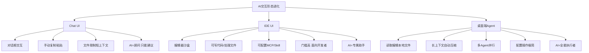
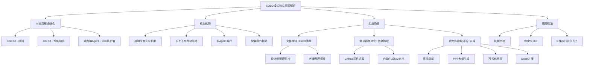

# 从Chat到Agent：为什么字节跳动要把Solo从Trae中独立出来？

## 摘要
本文深入解析字节跳动为何将Trae中的Solo模式独立为桌面端Agent应用。通过对比AI交互的三大形态（Chat UI、IDE UI、桌面端Agent），揭示Solo的核心优势：更低的使用门槛、更长的上下文、多Agent并行工作、以及极简的Skill/MCP配置。文章还通过文件整理、浏览器自动化、跨文件数据分析等实际案例，展示了Solo如何让AI从“顾问”真正变成“执行者”。

**技术关键词**：桌面端Agent、Chat UI、IDE UI、Skill、MCP、上下文压缩、多Agent并行、文件自动化、浏览器自动化、跨文件数据处理

---

## 目录
1. [三大AI交互形态的进化](#1)
2. [桌面端Agent vs 小龙虾：安全与效率的平衡](#2)
3. [Solo实战评测：三大场景](#3)
4. [高阶玩法：Skill、MCP与CI集成](#4)
5. [总结与思维导图](#5)

---

## 1. 三大AI交互形态的进化

### 1.1 Chat UI：AI是“顾问”，只能给建议

最早期，我们与AI的交互就是通过一个对话框，像聊天一样：
- 抛出一个问题，AI丢回一段文字
- 需要手动复制粘贴修改
- 上传文件限制（最多十几个）
- 上下文相对较短
- 无法直接修改PPT、Excel等复杂文件

**此时的AI更像一个“顾问”，能给出建议，但无法真正下场帮你做事。**

### 1.2 IDE UI：AI是“专属助手”，但只服务于开发者

以Cursor、VS Code为代表：
- AI可以直接帮你写代码、处理PPT和Excel
- 可以配置MCP、Skill、CI等
- **但缺点明显**：对新手小白不友好，使用门槛偏向开发者
- 所有操作局限在编辑器沙盒中

**此时的AI更像一个“专属助手”，但只服务于特定人群。**

### 1.3 桌面端Agent：AI是“全能执行者”，人人可用

以Solo、Codex为代表：
- **对所有人都非常友好**，无需编程基础
- 直接读取并编辑本地文件（PPT、Excel、Word等）
- 拥有更长的上下文，文件再多也能自动压缩处理
- 支持多个Agent同时干活，相当于拥有“AI军团”
- 配置Skill、MCP、CI等复杂操作变得极其简单高效

**此时的AI真正从“顾问”变成了“执行者”。**

---

## 2. 桌面端Agent vs 小龙虾：安全与效率的平衡

很多人会问：桌面端Agent和小龙虾有什么区别？

| 维度 | 桌面端Agent（Solo） | 小龙虾 |
|------|------|------|
| 权限范围 | 只操作你指定的文件夹 | 获取所有文件权限 |
| 安全机制 | 透明沙盒，新人小白更安全 | 全权限，风险较高 |
| 操作效率 | 指定路径，高效精准 | 全盘扫描，可能冗余 |

**Solo就像一个透明的沙盒，对于新人小白来说更加高效，也绝对安全。**

---

## 3. Solo实战评测：三大场景

Solo的界面标语是 **「More than coding」**，强调多场景办公任务。我们来看看它实际表现如何。

### 3.1 场景一：文件整理 + 生成Excel清单

**需求**：整理杂乱的下载文件夹，生成Excel清单，标记重复文件和建议删除的文件。

**过程**：
- Solo调用自身拥有的「处理Excel表格」技能
- 快速将文件夹整理好，生成文件整理清单
- 清晰列出图片、视频、音频等分类

**效果**：
- 对于设计师整理下载的图片、老师整理课件/题目非常方便
- 自动识别重复文件并提出删除建议

### 3.2 场景二：浏览器自动化 + 信息抓取

**需求**：在GitHub上搜索最近七天的优质项目，每个项目生成一个MD文档。

**过程**：
- Solo自动打开浏览器进行抓取
- 由Agent进行完整操作

**生成效果**：
- 每个项目包含核心亮点、技术栈、快速安装
- 比直接去GitHub看英文更快更高效

### 3.3 场景三：跨文件数据分析和生成

**需求**：对五个Excel表格（四个月份的竞品数据）进行分析，生成PPT大纲、可视化页面和Excel方案。

**过程**：
- Solo加载处理Excel的技能
- 自动进行竞品数据、市场价格分布、用户亮点和痛点分析

**生成结果**：
- **竞品分析报告**：包含总体趋势、增长异常点、对比结论
- **PPT大纲**：结构清晰
- **可视化网页**：图表效果很好，支持点击评论修改
- **Excel方案**：可进一步生成图表

**亮点功能**：
- 可视化页面支持**点击评论**进行修改
- 支持**添加到聊天框**进行二次修改
- 如果配置了钉钉CI/飞书CI，可直接将PPT/Excel发送到办公软件

> **评价**：PPT生成效果中档，排版和数据可视化有待优化，但分析参考价值很高。

---

## 4. 高阶玩法：Skill、MCP与CI集成

### 4.1 技能市场

点击「技能」按钮，进入技能市场，可以看到多种预设技能：

| 技能类型 | 用途 |
|---------|------|
| 前端生成界面 | 快速生成网页界面，对比使用/未使用效果 |
| 数据分析 | 自动进行数据分析和可视化 |
| 内容创作 | 使用CDANCE模型，从文本/图像生成视频 |
| Obsidian集成 | 接入笔记系统 |

### 4.2 自定义Skill

用户也可以上传自己的Skill，只需包含：
- `根基skill.md` 文件
- 打包成 `.zip` 或 `.skill` 文件

### 4.3 CI集成

配置钉钉CI、飞书CI后，可以直接将生成的文件（PPT、Excel等）发送到办公软件，实现工作流自动化。

---

## 5. 总结与思维导图

### 核心观点总结

1. **AI交互形态经历了三次进化**：Chat UI（顾问）→ IDE UI（专属助手）→ 桌面端Agent（全能执行者）
2. **Solo独立的原因**：降低使用门槛，让非开发者也能轻松使用AI完成多场景办公任务
3. **Solo的核心优势**：
   - 透明沙盒安全机制
   - 长上下文自动压缩
   - 多Agent并行工作
   - 极简的Skill/MCP配置
4. **三大实战场景验证**：文件整理、浏览器自动化、跨文件数据分析
5. **高阶玩法潜力**：技能市场 + 自定义Skill + CI集成，实现工作流自动化

### 思维导图

