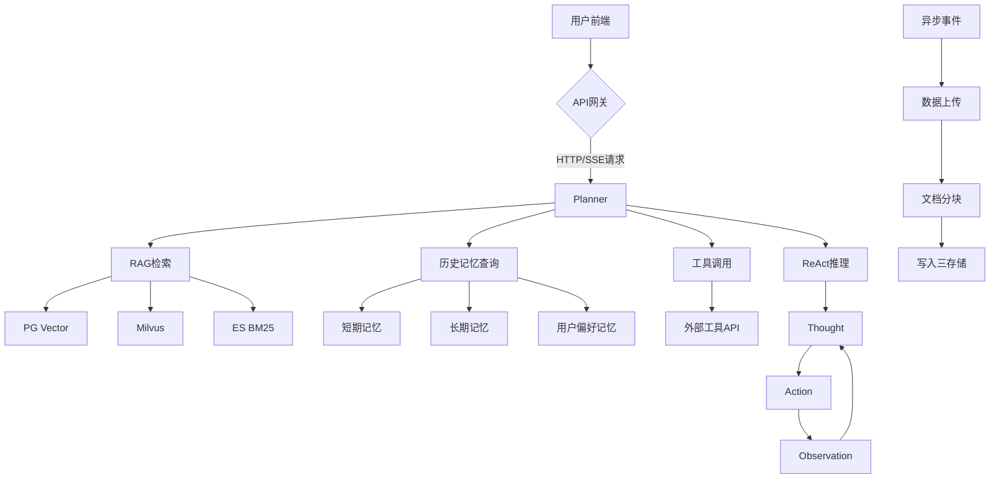
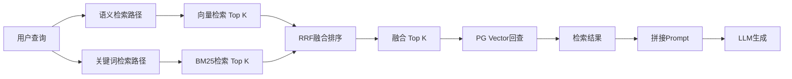
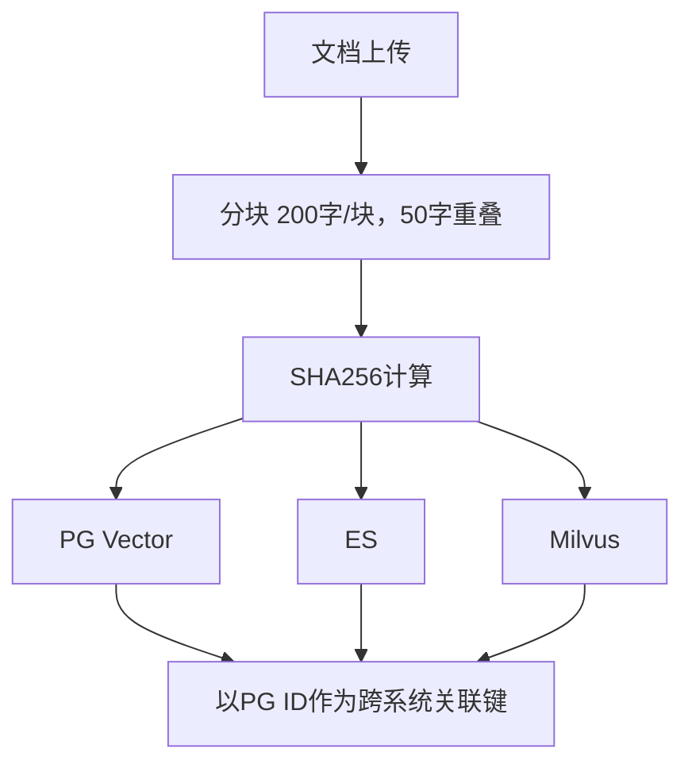
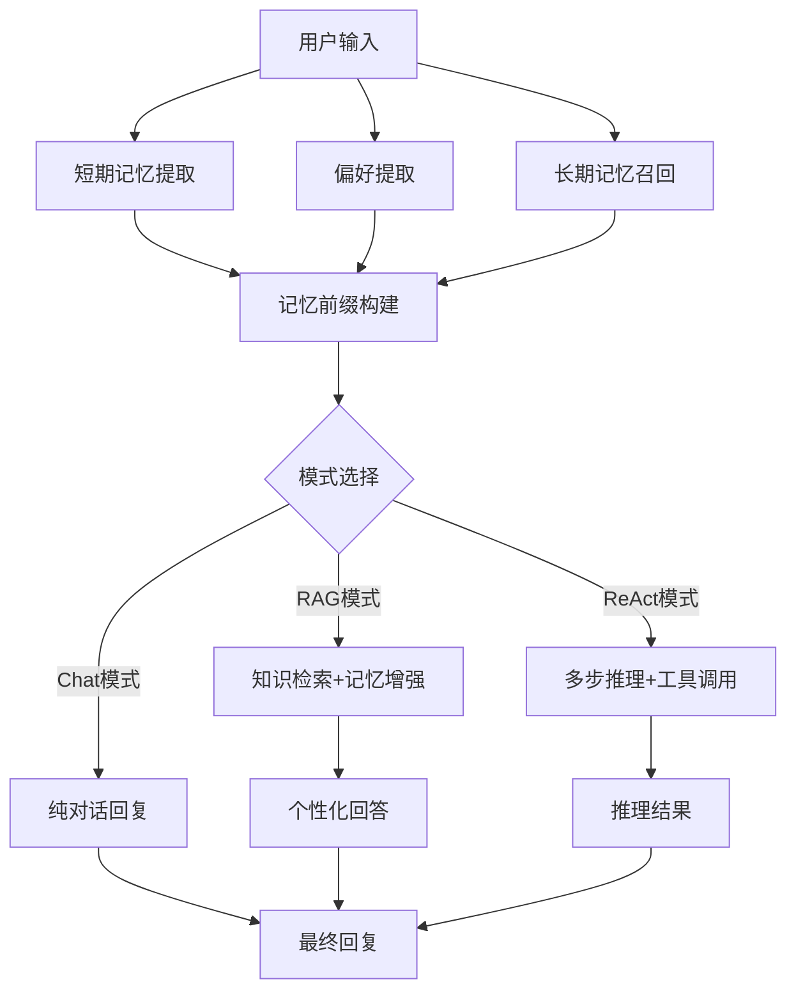
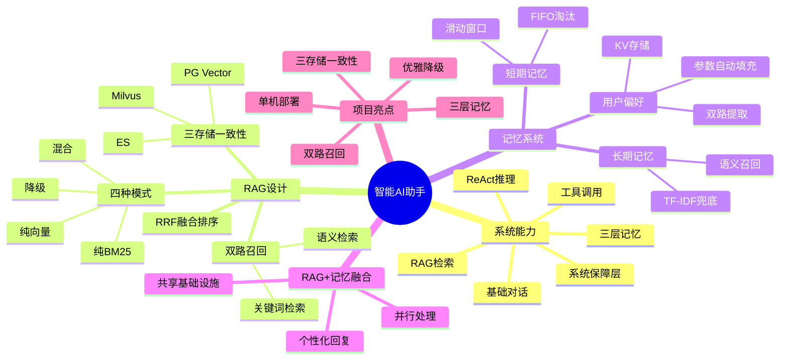

# 我的Agent项目（4）：融合RAG与三层记忆系统的智能AI助手架构解析

## 摘要

本文深入解析了一个集成了RAG（检索增强生成）与三层记忆系统的智能AI助手项目。项目核心亮点在于将RAG和记忆系统作为基础层深度融合，而非独立模块，实现了知识检索、工具调用、多步推理和个性化记忆等能力。文章详细介绍了项目的整体架构、双路召回RAG设计、三层记忆系统以及两者的融合机制，并提供了可落地的技术参数和部署建议。

## 目录

- [核心观点提炼](#核心观点提炼)
- [一、项目整体架构](#一项目整体架构)
  - [1.1 系统能力总览](#11-系统能力总览)
  - [1.2 系统架构图](#12-系统架构图)
- [二、RAG双路检索设计](#二rag双路检索设计)
  - [2.1 为什么需要RAG](#21-为什么需要rag)
  - [2.2 混合检索架构](#22-混合检索架构)
  - [2.3 RRF融合排序算法](#23-rrf融合排序算法)
  - [2.4 四种检索模式与优雅降级](#24-四种检索模式与优雅降级)
  - [2.5 三存储一致性](#25-三存储一致性)
  - [2.6 关键配置参数](#26-关键配置参数)
- [三、三层记忆系统](#三三层记忆系统)
  - [3.1 为什么需要记忆](#31-为什么需要记忆)
  - [3.2 短期记忆](#32-短期记忆)
  - [3.3 长期记忆](#33-长期记忆)
  - [3.4 用户偏好记忆](#34-用户偏好记忆)
  - [3.5 记忆持久化与管理](#35-记忆持久化与管理)
- [四、RAG与记忆的深度融合](#四rag与记忆的深度融合)
  - [4.1 融合机制](#41-融合机制)
  - [4.2 处理流程](#42-处理流程)
- [五、项目亮点与简历价值](#五项目亮点与简历价值)
- [思维导图](#思维导图)

## 核心观点提炼

1. **RAG与记忆系统深度融合**：两者不是独立功能，而是在AI内核外层深度耦合，作为基础层共同支撑智能回复。
2. **双路召回RAG**：采用语义检索（向量）与关键词检索（BM25）双流并行，通过RRF算法融合排序，解决单一检索方式的不足。
3. **三层记忆架构**：短期记忆（滑动窗口）、长期记忆（语义召回）、用户偏好记忆（KV结构化），分别对应上下文连贯、知识积累和个性化。
4. **优雅降级设计**：在环境不全或系统异常时，自动切换到可用模式，保证系统持续运行。
5. **全链路生产级设计**：包含三存储一致性、自动重试、超时控制、快速恢复等保障层。

## 一、项目整体架构

### 1.1 系统能力总览

本智能AI助手具备以下核心能力：

| 能力类别 | 具体功能 | 说明 |
|---------|---------|------|
| 基础对话 | LM直接生成回复 | 支持控制token消耗、快速改写、密等型设计 |
| 知识检索 | RAG | 混合检索（语义+关键词），支持文档上传 |
| 工具调用 | Tool / MCP Skills | 外部工具调用能力 |
| 多步推理 | ReAct | Thought→Action→Observation 循环 |
| 记忆系统 | 三层记忆 | 短期、长期、用户偏好 |
| 系统稳定性 | 保障层 | 自动重试、超时控制、快速恢复、优雅降级 |

### 1.2 系统架构图

## 二、RAG双路检索设计

### 2.1 为什么需要RAG

- **问题**：LLM只能基于训练数据回答，无法处理私有领域或实时信息。
- **解决**：通过检索外部知识库，补充实时、精准的上下文。

### 2.2 混合检索架构

传统RAG只使用向量语义匹配，对关键词精准匹配效果差。本系统采用**语义检索 + 关键词检索**双流召回。

### 2.3 RRF融合排序算法

**RRF** 是一种无参归一化的多路排序算法，核心思想：
- 排名越靠前的文档得分越高
- 不同检索路径的贡献均等

**公式**：`score = Σ 1/(k + rank_i)`，其中 k 为平滑常数

**示例**：
- 文档A：语义排第1，关键词排第3
- 文档B：语义排第2，关键词排第2
- RRF排序后，文档B总分最高，融合排名第一

**优势**：
- 无需对齐不同检索系统的量纲
- 对单路召回失败的文档有天然容错
- 计算简单，无需训练

### 2.4 四种检索模式与优雅降级

| 模式 | 可用环境 | 说明 |
|------|---------|------|
| 纯BM25关键词检索 | 仅有ES | 关键词精准匹配 |
| 纯向量语义检索 | 仅有Milvus/PG Vector | 语义相似度匹配 |
| 混合检索 | 两者均有 | 双路召回+RRF融合 |
| 降级模式 | 两者均不可用 | 返回空检索结果 |

### 2.5 三存储一致性

文档上传后，一条数据同时写入三个存储系统：

删除时同样保证三个存储的一致性。

### 2.6 关键配置参数

| 参数 | 值 | 说明 |
|------|-----|------|
| Top K | 可配置 | 每路召回候选数 |
| 分块大小 | 200字符 | 每个向量块长度 |
| 重叠字符数 | 50字符 | 块与块之间的重叠 |
| 向量维度 | 根据模型配置 | 如768/1024 |
| RRF平滑常数k | 60 | RRF公式中的常数 |

## 三、三层记忆系统

### 3.1 为什么需要记忆

- **问题**：LLM是无状态的，每次对话都是全新的。
- **解决**：记忆系统让AI具备上下文连贯、知识积累和个性化能力。

### 3.2 短期记忆

- **机制**：滑动窗口保留最近N轮对话
- **容量**：5轮 × 2 = 10条消息
- **淘汰策略**：FIFO（先进先出），丢弃最旧消息
- **注入方式**：直接注入LLM消息列表

### 3.3 长期记忆

- **存储**：数据库持久化，永久存储重要事实和偏好
- **召回方式**：语义召回 + TF-IDF兜底
- **流程**：
  1. 用户查询生成查询向量
  2. 余弦相似度计算综合评分
  3. 阈值过滤
  4. Top K排序返回

**评分公式**：综合评分 = 相似度 × 重要性权重

### 3.4 用户偏好记忆

- **存储**：KV结构化存储
- **提取方式**：LLM识别 + 规则提取 双路
- **注入方式**：
  - System Prompt注入
  - 工具参数自动填充

**示例**：
- 用户说“今天天气怎么样”
- 偏好记忆中用户居住“北京”
- 自动填充天气工具参数为“北京”

**偏好参数映射表**：
| 偏好Key | 参数名 | 说明 |
|---------|-------|------|
| city | location | 城市参数 |
| language | lang | 语言偏好 |

### 3.5 记忆持久化与管理

- 所有记忆持久化到PG Vector
- 重启后自动恢复
- 支持长期记忆的管理操作

## 四、RAG与记忆的深度融合

### 4.1 融合机制

RAG和记忆不是独立功能，而是在AI内核外层深度融合：
- 两者共享相同的向量存储和检索基础设施
- 在用户输入处理时，同时进行记忆召回和知识检索
- 最终生成融合了用户记忆和外部知识的个性化回复

### 4.2 处理流程

## 五、项目亮点与简历价值

| 亮点 | 说明 | 简历关键词 |
|------|------|-----------|
| 双路召回RAG | 语义+关键词混合检索 | 混合检索、RRF融合排序 |
| 三存储一致性 | PG+ES+Milvus数据同步 | 多存储一致性、异步写入 |
| 三层记忆架构 | 短期+长期+偏好 | 记忆系统、个性化AI |
| 全链路优雅降级 | 环境不全时自动切换 | 容错设计、生产级系统 |
| 单机部署友好 | 降低部署门槛 | Docker化、环境适配 |

**技术栈**：Python、LLM API、PG Vector、Milvus、Elasticsearch、ReAct、MCP

## 思维导图

