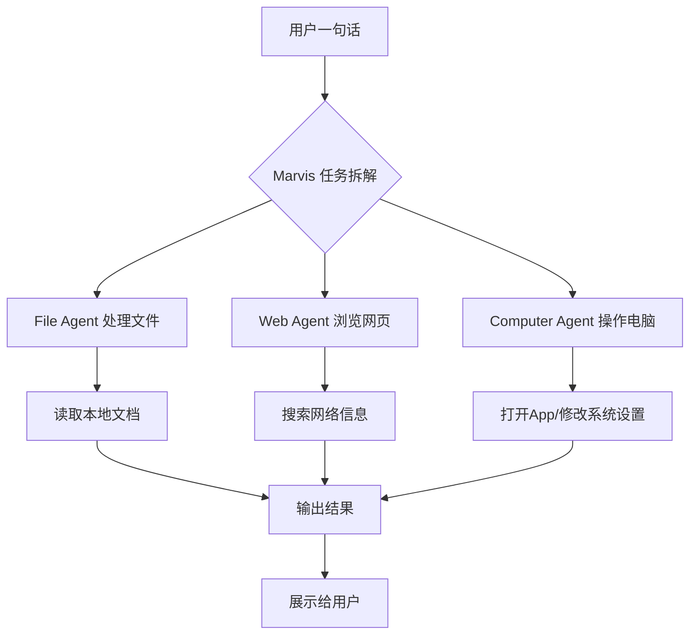
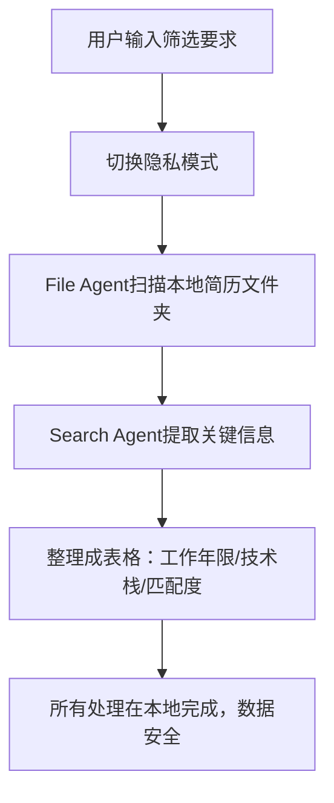
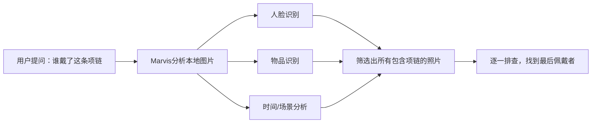
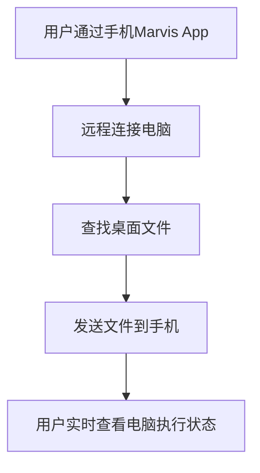
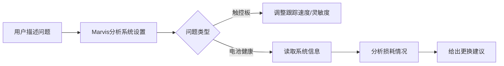
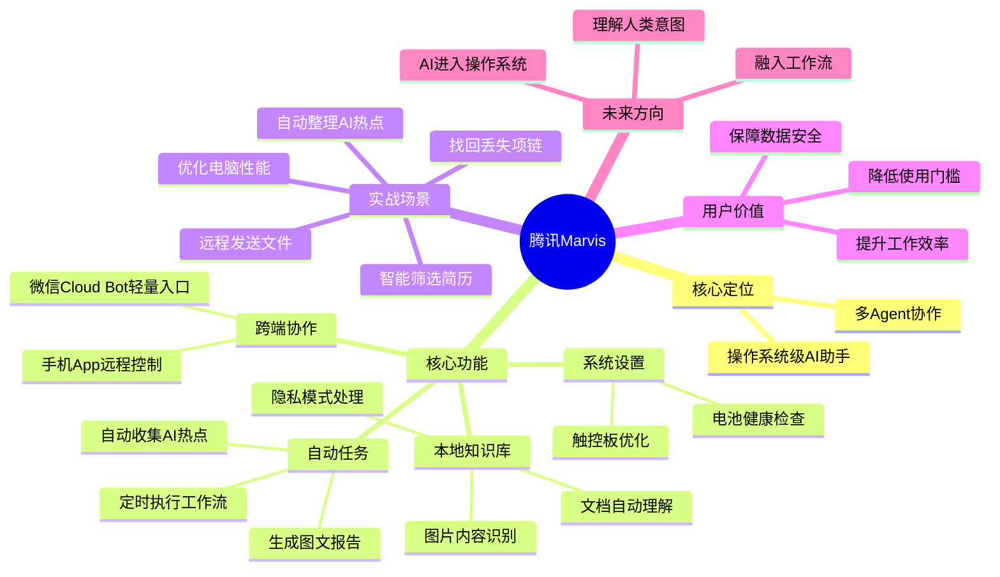

# 腾讯Marvis实测：AI开始操作电脑，人人都有自己的AI助理

## 摘要

本文基于腾讯Marvis的实测体验，展示了这款操作系统级个人AI助手如何在日常工作中发挥作用。它不仅能理解人类意图，还能直接操作电脑、管理文件、处理图片、执行定时任务，甚至通过手机远程控制电脑。文章通过几个真实场景，带你感受AI从「聊天工具」进化为「操作系统级助手」带来的效率革命。

## 目录

1. [核心内容提炼](#核心内容提炼)
2. [Marvis是什么](#marvis是什么)
3. [场景一：自动收集AI热点并生成报告](#场景一自动收集ai热点并生成报告)
4. [场景二：智能筛选简历（隐私模式）](#场景二智能筛选简历隐私模式)
5. [场景三：根据图片内容找回丢失物品](#场景三根据图片内容找回丢失物品)
6. [场景四：手机远程控制电脑](#场景四手机远程控制电脑)
7. [场景五：系统设置与电脑优化](#场景五系统设置与电脑优化)
8. [总结与展望](#总结与展望)
9. [思维导图](#思维导图)

## 核心内容提炼

- **告别复杂操作**：用户不再需要记住文件路径、系统设置或层层翻找文件夹，一句话即可完成任务。
- **多Agent协作**：Marvis内部有多个AI「员工」，分别负责文件处理、网页浏览、电脑操作等，任务自动拆解执行。
- **真实场景验证**：通过自动整理AI热点、筛选简历、找回丢失项链、手机远程发文件、优化电脑触控板等案例，证明其实用价值。
- **隐私安全优先**：支持本地模型处理敏感数据，如简历筛选时完全在本地完成，不上传云端。
- **跨端协作**：手机App可远程接管电脑，实现文件查找、任务触发等操作。
- **系统级深度整合**：不仅能聊天，还能参与文件管理、图片理解、App操作、系统设置、自动任务处理和跨端协作。

## Marvis是什么

腾讯对Marvis的定义是**操作系统层级的个人AI助手**。它不是一个简单的聊天框，而是一个「AI办公室」——内部有多个AI Agent，分别负责不同任务：

- **File Agent**：负责文件处理
- **Web Agent**：负责浏览网页
- **Computer Agent**：负责操作电脑

用户只需一句话，Marvis会自动拆解任务，分派给不同的Agent执行，并在右侧实时显示每个Agent的执行状态和Token消耗。

## 场景一：自动收集AI热点并生成报告

### 任务描述
每天自动收集GitHub上的热门AI项目，生成图文并茂的报告，便于后续发布和整理。

### 执行过程
1. 用户创建定时任务（每晚8点执行）
2. 任务描述中使用了两个Skills：研究写作 + PPT
3. Marvis自动调用Web Search工具完成搜索和内容整理
4. Computer Agent打开本地备忘录App，将图文内容写入

**效果**：以前需要手动打开十几个网页慢慢整理，现在每天睡觉前安排任务，第二天早上报告已经自动生成。

## 场景二：智能筛选简历（隐私模式）

### 任务描述
本地有100多份候选人简历，让Marvis筛选出符合要求的求职者，并整理成表格。

### 执行过程
1. 用户提前切换到**隐私模式**（使用本地大模型处理）
2. 输入提示词后，File Agent自动扫描简历文件夹
3. Search Agent提取简历内的关键信息（工作年限、技术栈、项目经验、匹配度等）
4. 最终输出表格

**价值**：对HR、财务、法务等处理敏感数据的用户，既提升了效率，又保障了数据安全。

## 场景三：根据图片内容找回丢失物品

### 任务描述
老婆的项链丢失，怀疑是出去玩时弄丢的，但不知道谁最后佩戴、何时最后一次出现。让Marvis从本地照片中找出谁戴了这条项链。

### 执行过程
1. Marvis自动分析本地图片（人物、时间、场景、视频特征）
2. 筛选出所有包含项链的照片
3. 逐一查看照片，发现：
   - 黑衣少年戴的是自己的项链 → 排除
   - 迷彩外套小男孩戴的正是丢失的项链 → 破案

**亮点**：Marvis不只是按文件名搜索，而是真正理解图片内容，包括人物、物品、场景。

## 场景四：手机远程控制电脑

### 两种方式
1. **手机端Marvis App**：功能完整，可聊天、管理任务、添加技能、远程接管电脑
2. **微信Cloud Bot**：轻量级入口，适合简单搜索文件、查询任务、触发任务

### 实战案例
出门在外，老板突然要求发电脑里的方案文件。通过手机Marvis App说：「帮我把桌面上的方案文件发到我的手机」，Marvis会：
1. 远程连接电脑
2. 查找桌面文件
3. 发送到手机

**对比**：微信Cloud Bot适合轻操作，手机App适合完整的远程控制。

## 场景五：系统设置与电脑优化

### 典型应用
- **触控板不跟手**：一句话「帮我调一下触控板」，Marvis自动分析当前设置（跟踪速度、灵敏度），直接做出调整
- **电池健康检查**：自动读取系统信息，分析电池损耗情况，给出是否需要更换电池的建议

**意义**：普通用户不再需要研究复杂的系统设置，电脑终于开始理解人类意图。

## 总结与展望

Marvis带来的最大感受不是「AI变聪明了」，而是**电脑终于开始理解人类的意图**。用户不再需要：
- 记住复杂的文件路径
- 研究困难的系统设置
- 一层层翻看文件夹

现在，很多事情一句话就能轻松搞定。Marvis已经不只是聊天工具，它开始参与：
- 文件管理
- 图片理解
- App操作
- 系统设置
- 自动任务处理
- 跨端协作

这可能是未来AI的发展方向：**AI不应该只是网页里的对话框，而是真正进入我们的电脑、工作流，甚至生活和工作本身。**

## 思维导图

