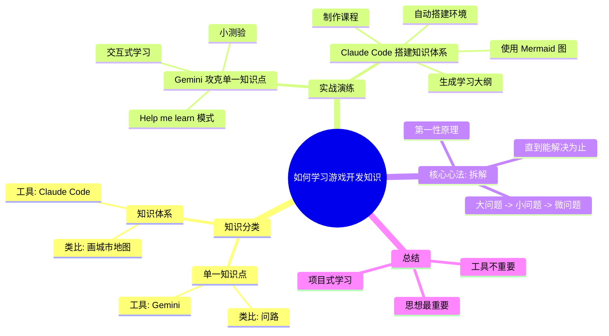

好的，没问题。作为中文技术内容编辑，我将根据您提供的视频内容，整理成一篇结构清晰、适合发布、有趣的中文博客文章。

---

# 别再死磕了！游戏大佬私藏的“AI拆解式”学习法，专治学不会

## 摘要

你是不是也这样？看各路大佬轻松掌握新技能，轮到自己却总是“一看就会，一学就废”？别急，这很可能不是你的问题，而是方法不对。

本期内容，我们将为你拆解一套高效的学习“元方法”。它不需要你有多聪明，只需要你掌握一个核心思想：**把大问题拆成小问题，直到你能解决为止**。配合AI工具（如Gemini和Claude），你将发现，学习任何硬核知识，都可以变得像玩游戏一样，有问有答，层层通关。

## 目录

- [序章：你是不是也陷入了“学习焦虑”？](#序章你是不是也陷入了学习焦虑)
- [Part 1：学习知识的两大类型](#part-1学习知识的两大类型)
- [Part 2：实战演练一：用Gemini攻克“单一知识点”](#part-2实战演练一用gemini攻克单一知识点)
- [Part 3：实战演练二：用Claude Code搭建“知识体系”](#part-3实战演练二用claude-code搭建知识体系)
- [Part 4：核心心法：解决问题的“第一性原理”](#part-4核心心法解决问题的第一性原理)
- [总结：告别死记硬背，拥抱拆解式学习](#总结告别死记硬背拥抱拆解式学习)
- [思维导图](#思维导图)

---

## 序章：你是不是也陷入了“学习焦虑”？

你是否也曾有过这样的困惑：

- 看到大佬轻松搞定各种硬核知识，自己却无从下手？
- 学了一堆资料，感觉懂了，但一上手就“似懂非懂”？
- 面对复杂的工具和库，感觉像在画一张陌生的城市地图，完全不知道从何开始？

别担心，你不是一个人。大家好，我是紫雨。今天，我将分享一套我自己一直在用的学习方法。虽然我专注于游戏开发，但这个方法适用于任何你想掌握的知识或技能。

## Part 1：学习知识的两大类型

首先，我们要把知识分为两类，就像地图上的两种任务：

1.  **单一知识点：**
    -   **概念：** 主要针对算法、思路等具体问题。比如“如何实现自动寻怪”。
    -   **类比：** 就像在一个陌生的城市里问路。你只需要一个明确的方向，就能到达目的地。
    -   **推荐工具：** **Google Gemini**（网页版）。

2.  **知识体系：**
    -   **概念：** 针对某个工具或第三方库的完整用法，比如“如何使用OpenGL”。
    -   **类比：** 就像画一张完整的城市地图。你需要一步一步探索，搞清楚城市的方方面面。
    -   **推荐工具：** **Claude Code**。

## Part 2：实战演练一：用Gemini攻克“单一知识点”

我们直接上实战。打开Gemini网站，输入你的问题。但别急着像问普通AI那样问，Gemini有个秘密武器：**“Help me learn”** 功能。

1.  在输入框下方，点击 **“Help me learn”** 按钮。
2.  此时，Gemini会进入“引导式学习”模式。
3.  输入你的问题，比如“如何实现自动寻怪”。

你会发现，它的回答不再是长篇大论，而是被拆分成了**循序渐进的小单元**，并且是**交互式的**。

-   **Step 1：** 它先给一个概括性的概念，很好理解。
-   **Step 2：** 你需要输入“1”，它才会针对第一个小问题进行详细解释。
-   **Step 3：** 解释完后，它会给你一个**小测验**。你必须作答才能继续学习。

    ```mermaid
    graph LR
        A[开始学习] --> B{回答小测验}；
        B -- 错误 --> C[AI给出定制化解释]；
        C --> B；
        B -- 正确 --> D[进入下一单元]；
        D --> A；
    ```

-   **实战演示：** 假设它问“往左和往下走，坐标值怎么变？”，你答错了，它会根据你的错误原因，给你更针对性的解释。答对了，它才会引导你进行下一步。

这种“有问有答、逐步深入”的方式，远比一口气给你一大段回答要好得多。

## Part 3：实战演练二：用Claude Code搭建“知识体系”

接下来，我们挑战更复杂的“知识体系”。以学习OpenGL为例，我们使用Claude Code。

1.  **环境搭建：** 创建一个空文件夹，通过终端打开，输入 `claude`。告诉它你想学习OpenGL，并希望它能帮你搭建初始环境。

    -   它会推荐经典学习网站。
    -   更厉害的是，它会直接帮你**下载好所有第三方依赖库**，写好CMake文件，甚至生成一个最基本的“Hello World”程序。你完全不需要操心环境配置。

    ```bash
    # 运行Claude Code
    claude
    ```

2.  **生成学习大纲：** 环境搞定后，让Claude Code为你做一份学习大纲。告诉它你的知识背景（比如“我有C++基础”），以及对课程的要求。

    -   它会为你划分出**6大模块，20多节课**，逻辑清晰，结构完整。

3.  **制作第一节课程：** 让它开始制作第一节课。它会生成一份Markdown文件，内容包含文字解释和代码示例。

4.  **让图表更清晰：** 我们常说“一图胜千言”。为了让AI生成的图表更清晰，你可以告诉它：“**教程中多使用Mermaid图**”。

    -   Mermaid是一种生成图表的语言，非常适合嵌入Markdown。
    -   经过这个指令，Claude Code生成的教程里，就会包含**时间轴图、流程图、甚至色彩丰富的流程图**，理解起来一目了然。

    ```mermaid
    graph TD
        A[用户输入: 学习OpenGL] --> B{Claude Code}；
        B --> C[下载依赖库]；
        B --> D[编写CMake文件]；
        B --> E[生成Hello World程序]；
        B --> F[生成学习大纲]；
        B --> G[制作每一节课(Markdown)]；
        G --> H[包含Mermaid图]；
    ```

5.  **固化学习习惯：** 你还可以让Claude Code创建一个 `claude.md` 文件，记录一些学习细节。以后每次开启Claude，它都会自动读取这个文件，保持学习风格和习惯的一致性。

## Part 4：核心心法：解决问题的“第一性原理”

你可能会觉得，这期内容和上一期很像。没错，因为我们的底层逻辑是一样的——**“拆解”**。

这可以看作是一种“元方法”，或者说“第一性原理”。它的核心思想是：

**当你遇到任何一个问题时，都要想办法把它拆解。把一个大问题拆解成若干个小问题，然后看这些小问题自己能不能解决。如果还不能，就继续拆解，直到碰到一个你能真正理解或解决的问题，然后开始着手。**

```mermaid
flowchart LR
    A[一个复杂的大问题] --> B{拆解}；
    B --> C[子问题1]；
    B --> D[子问题2]；
    B --> E[子问题3]；
    C --> F{能解决吗？}；
    F -- 不能 --> G[继续拆解]；
    G --> C；
    F -- 能 --> H[动手解决]；
    D --> I{能解决吗？}；
    I -- 不能 --> J[继续拆解]；
    J --> D；
    I -- 能 --> K[动手解决]；
    E --> L{能解决吗？}；
    L -- 不能 --> M[继续拆解]；
    M --> E；
    L -- 能 --> N[动手解决]；
```

这个拆解过程可以不断循环嵌套，直到你搞定所有问题。这不仅仅是软件开发，任何知识或工作都可以遵循这个原理。

**工具（Gemini、Claude）并不重要，重要的是这种解决问题的思想。**

## 总结：告别死记硬背，拥抱拆解式学习

掌握了这种“拆解式”学习方法，你就能明白，为什么一个非科班生也能做出“C++游戏开发之旅”这样的系列项目。因为面对庞大的知识体系，你不再害怕，而是从容地把它拆解成一个个可以学习的小单元。

下一期，我们将进一步看到这种方法的威力，并展示项目式学习方法。掌握了它，你也能独立做出属于自己的学习项目，甚至做得更好。

---

## 思维导图

